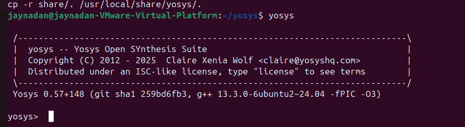
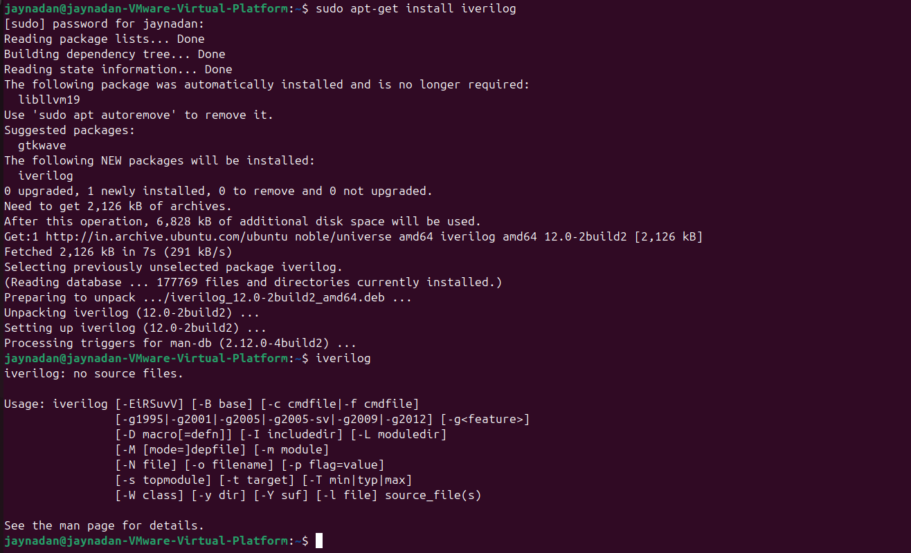
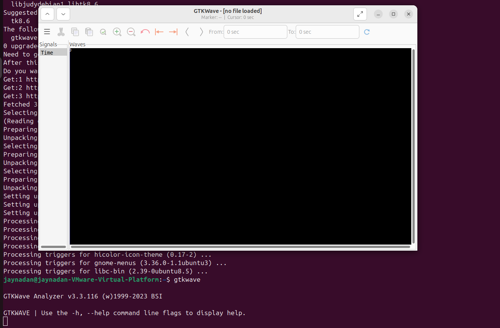
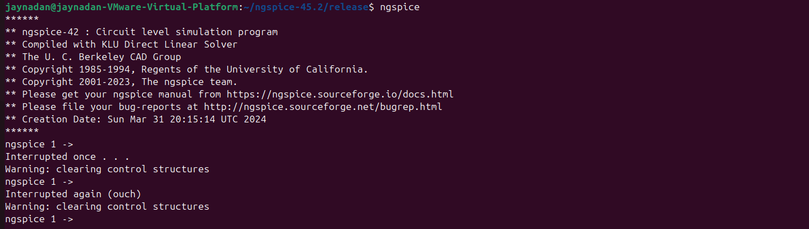
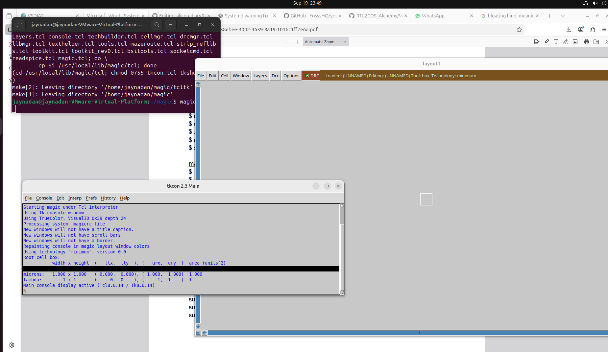

# 🚀 Day 0 – VSD Program Kickoff & Toolchain Setup  

<div align="center">

  
  
  

</div>  

Welcome to the very first step of my **Silicon Diary** 📝.  
Day 0 was all about **laying the foundation**: 
- Getting started with Digital VLSI SOC Design and Planning
- Creating this GitHub repository to document my journey.  
- Setting up a **Linux-based design environment** and installing essential tools.  

---

## 🎯 Task Breakdown  

| # | Task | Outcome |
|---|------|---------|
| 1️⃣ | **Summarize Getting started with Digital VLSI SOC Design and Planning Video** | Key takeaways captured with screenshot |
| 2️⃣ | **Install Open-Source EDA Tools** | Yosys, Icarus Verilog, GTKWave, Ngspice, Magic VLSI installed & tested |

---

##   

The introductory session explained the **SoC design flow** step by step:  

- **Specs (C model)** ➝ High-level system behavior defined in C.  
- **RTL Design (Verilog)** ➝ Hardware description created by RTL architects.  
- **Processor + IPs** ➝ Integration of processor core and peripherals.  
- **Gate-level Netlist** ➝ RTL synthesized into logic gates.  
- **SoC Integration** ➝ Combining macros, analog IPs, and GPIOs.  
- **Floorplanning & GDSII** ➝ Physical design and final tape-out.  

## 📷 **Flow Chart of SoC design flow**
<p align="center">
  

</p>

<div align="center"></div>

---
## 

Installed all required open-source EDA tools for the RTL2GDS flow using a Linux-based setup.  
This section provides an overview of each tool, its purpose in the design flow, and a snapshot of successful installation.

---

## 🧠 Yosys – RTL Synthesis

- **What is it?**  
  This is a framework for RTL synthesis tools. It currently has extensive Verilog-2005 support and provides a basic set of synthesis algorithms for various application domains.

Yosys can be adapted to perform any synthesis job by combining the existing passes (algorithms) using synthesis scripts and adding additional passes as needed by extending the yosys C++ code base.

---
- **Purpose in Design Flow:**  
Yosys's purpose in a design flow is to act as an open-source logic synthesis tool, taking high-level hardware descriptions in Verilog or other HDLs and converting them into a detailed, optimized gate-level netlist for ASICs or FPGAs. It performs logic optimization and technology mapping to produce efficient designs, and its extensible nature makes it a flexible base for custom synthesis tools within a larger design ecosystem._
---
<summary>📌 <b>Installation Steps</b></summary>  

```bash
Yosys
$ sudo apt-get update
$ git clone https://github.com/YosysHQ/yosys.git
$ cd yosys
$ sudo apt install make (If make is not installed please install it)
$ sudo apt-get install build-essential clang bison flex \
libreadline-dev gawk tcl-dev libffi-dev git \
graphviz xdot pkg-config python3 libboost-system-dev \
libboost-python-dev libboost-filesystem-dev zlib1g-dev
$ make config-gcc
$ make
```

---
- **📸 Tool Installation Verification Image:**  
  

- **🔗 References:**  
  - [ about Yosys] [https://github.com/YosysHQ/yosys](#)
  - [ For more information ] [https://yosyshq.net/yosys/](#)

---

## ⚙️ Icarus Verilog – HDL Simulation

- **What is it?**  
Icarus Verilog is an implementation of the Verilog hardware description language compiler that generates netlists in the desired format (EDIF) and a simulator. It supports the 1995, 2001 and 2005 versions of the standard, portions of SystemVerilog, and some extensions._
---
- **Purpose in Design Flow:**  
  _
Icarus Verilog serves a crucial purpose in the System-on-Chip (SoC) design flow, primarily as an open-source Verilog simulator and synthesis tool. Its main functions in this context include:

    RTL Simulation and Verification:
        Icarus Verilog compiles and simulates Verilog HDL code, allowing designers to verify the functional correctness of their Register-Transfer Level (RTL) designs.
        It executes the compiled Verilog code, often generating Value Change Dump (VCD) files that capture the signal waveforms over time. These VCD files can then be viewed and analyzed using waveform viewers like GTKWave for debugging and understanding the design's behavior.
        This simulation phase is critical for identifying and correcting design errors early in the flow, before committing to more expensive physical implementation_
---
<summary>📌 <b>Installation Steps</b></summary>  

```bash
Steps to install iverilog
sudo apt-get update
sudo apt-get install iverilog
```

---
- **📸 Tool Installation Verification Image:**  
  

- **🔗 References:**  
  - [ wikipedia] [https://www.google.com/url?sa=t&source=web&rct=j&opi=89978449&url=https://en.wikipedia.org/wiki/Icarus_Verilog&ved=2ahUKEwjZ1rHFyuWPAxWixDgGHUwQK-gQFnoECBkQAw&usg=AOvVaw22K9glLBZOCY6_iBzqdtT7](#)

---

## 📈 GTKWave – Waveform Viewer

- **What is it?**  
GTKWave has been developed to perform debug tasks on large systems on a chip and has been used in this capacity as an offline replacement for third-party debug tools. It is 64-bit clean and is ready for the largest of designs given that it is run on a workstation with a sufficient amount of physical memory._

---
  **Purpose in Design Flow:**  
  _
  To see the RTL Verilog code simulation waveform to verify the specifications

  ---
<summary>📌 <b>Installation Steps</b></summary>  

```bash
Steps to install gtkwave
sudo apt-get update
sudo apt install gtkwave
```
---
- **📸 Tool Installation Verification Image:**  
  
---

- **🔗 References:**  
  - [ github] [https://gtkwave.github.io/gtkwave/](#)
  - [ Main site] [https://gtkwave.sourceforge.net/](#)

---

## 🔁 Ngspice – Analog Simulation

- **What is it?**  
ngspice is the open source spice simulator for electric and electronic circuits.
Such a circuit may comprise of JFETs, bipolar and MOS transistors, passive elements like R, L, or C, diodes, transmission lines and other devices, all interconnected in a netlist. Digital circuits are simulated as well, event driven and fast, from single gates to complex circuits. And you may enter the combination of both analog and digital as a mixed-signal circuit._

  --- **Purpose in Design Flow:**  
gspice is a circuit simulator that numerically solves equations describing (electronic) circuits: These are made of passive and active devices. Time varying currents and voltages are simulated as well as noise and small signal behavior.
<summary>📌 <b>Installation Steps</b></summary>  

```bash
After downloading the tarball from https://sourceforge.net/projects/ngspice/files/ to a local
directory, unpack it using:
$ tar -zxvf ngspice-37.tar.gz
$ cd ngspice-37
$ mkdir release
$ cd release
$ ../configure --with-x --with-readline=yes --disable-debug
$ make
$ sudo make install
```
---

- **📸 Tool Installation Verification Image:**  
  

- **🔗 References:**  
  - [ NGSPICE] [https://ngspice.sourceforge.io/](#)
  

---

## 🧱 Magic VLSI – Layout Editor

- **What is it?**  
Magic VLSI is an open-source electronic design automation (EDA) tool for designing and modifying Very Large Scale Integration (VLSI) circuits, also known as integrated circuits (ICs). Created in the 1980s at UC Berkeley, it uses a lambda-based design style with well-thought-out algorithms and a liberal license that makes it popular in universities and smaller companies for its ease of use, advanced features like automatic rule checking, and ability to stay current with fabrication technology_

- **Purpose in Design Flow:**  
The primary purpose of the Magic VLSI tool is to design and edit integrated circuit (IC) layouts by providing a user-friendly, interactive environment for creating the physical structures of electronic circuits_

- **📸 Snapshot:**  
  

- **🔗 References:**  
  - [ Magic] [http://opencircuitdesign.com/magic/](#)

---

# 🚀 Environment Ready for VLSI Design Journey!
---
## 🚀 **VLSI Design Journey – Ready to Begin!**

<div align="center">
  
  
  [📂 **Repository:** silicon-diary](https://github.com/Jaynandan-Kushwaha/silicon-diary)

  
  [👨‍💻 **Author:** Jaynandan Kushwaha](https://github.com/Jaynandan-Kushwaha)

  
  [📚 **Program:** VLSI System Design (VSD)](https://www.vlsi.org/)
</div>

