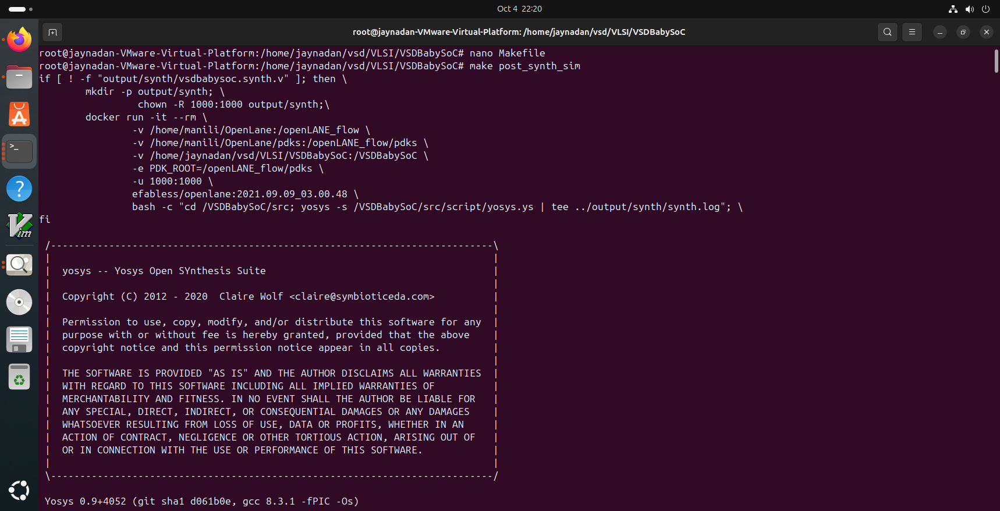

# 🧪 VSDBabySoC – Lab Process Documentation  

This document captures the **lab workflow** for building, simulating, and analyzing the **VSDBabySoC** project.  
It serves as a guide for students, researchers, and hobbyists who want to practically explore **RISC-V SoC design** with **PLL** and **DAC integration** on **Sky130 open-source PDK**.  

---

## 📌 Objectives  

- Understand the **design flow of an SoC** with digital and analog IPs.  
- Integrate **RVMYTH CPU**, **PLL**, and **DAC** into a single system.  
- Learn how **clock synchronization** and **digital-to-analog conversion** are verified.  
- Perform **simulation, waveform analysis, and output validation**.  

---
## ⚙️ BabySoC Design Modules

The **VSDBabySoC** is built by integrating three open-source IPs into one compact SoC:  
1. A **RISC-V Core (RVMYTH)**  
2. A **Phase-Locked Loop (PLL)**  
3. A **Digital-to-Analog Converter (DAC)**  

Each of these modules plays a crucial role in achieving a fully functional **digital-to-analog educational SoC**.

---

### 🔹 2.1 vsdbabysoc.v (Top-Level SoC Module)

The `vsdbabysoc.v` file is the heart of the design — it brings together the CPU, PLL, and DAC into one top-level system.  
👉 Source: [VSDBabySoC GitHub Repo](https://github.com/manili/VSDBabySoC.git)  

- **Inputs**  
  - `reset`: Resets the RISC-V processor.  
  - `VCO_IN, ENb_CP, ENb_VCO, REF`: Control and reference signals for the PLL.  
  - `VREFH`: Reference voltage for the DAC.  

- **Outputs**  
  - `OUT`: The final analog output from DAC.  

- **Internal Connections**  
  - `RV_TO_DAC`: A 10-bit bus carrying RVMYTH’s output into the DAC.  
  - `CLK`: Stable clock generated by the PLL.  

✨ This is the **integration point** where digital logic meets clock synchronization and analog conversion.  

---

### 🔹 2.2 rvmyth.v (RISC-V Core)

The `rvmyth.v` module is a lightweight, educational **RISC-V CPU core**. It acts as the brain of the BabySoC, processing instructions and producing digital data for the DAC.  
👉 Source: [RVMYTH GitHub Repo](https://github.com/kunalg123/rvmyth/)  

- **Inputs**  
  - `CLK`: Clock input generated by PLL.  
  - `reset`: Resets/initializes the processor.  

- **Outputs**  
  - `OUT`: A 10-bit processed digital value that is fed into the DAC.  

✨ Think of it as the **data generator** — sequential values, instructions, or signals produced by RVMYTH become the basis of the analog waveform at the output.  

---

### 🔹 2.3 avsdpll.v (PLL Module)

The `avsdpll.v` module provides a **stable, synchronized clock** for the entire SoC. Without it, timing mismatches could break communication between the CPU and DAC.  
👉 References: [PLL Intro](https://github.com/ireneann713/PLL.git), [avsdpll Repo](https://github.com/lakshmi-sathi/avsdpll_1v8.git)  

- **Inputs**  
  - `VCO_IN, ENb_CP, ENb_VCO, REF`: Control/reference signals for PLL operation.  

- **Output**  
  - `CLK`: A clean, synchronized system clock.  

✨ The PLL ensures **all blocks work in harmony** by eliminating jitter and aligning phases.  

---

### 🔹 2.4 avsddac.v (DAC Module)

The `avsddac.v` module converts the **10-bit digital stream** from RVMYTH into a continuous **analog output signal**.  
👉 Source: [avsddac Repo](https://github.com/vsdip/rvmyth_avsddac_interface.git)  

- **Inputs**  
  - `D`: 10-bit digital data input from RVMYTH.  
  - `VREFH`: Reference voltage for scaling the DAC output.  

- **Output**  
  - `OUT`: Analog waveform output.  

✨ This is where the magic happens — digital binary values finally become a **real-world analog signal** (for sound, video, etc.).  

---

## 🧪 Testbench  

The `testbench.v` file validates the integration and functionality of the entire BabySoC.  

- **Features**  
  - Initializes signals (reset, clocks, inputs).  
  - Generates reference clock for PLL.  
  - Dumps waveforms for analysis.  

- **Outputs**  
  - `pre_synth_sim.vcd` → Simulation before synthesis.  
  - `post_synth_sim.vcd` → Simulation after synthesis with gate-level netlist.  

✨ Using **GTKWave**, you can visualize:  
- PLL clock stabilization.  
- RVMYTH register updates.  
- DAC output signal evolution.  

---
 


## 🛠️ Tools & Environment  

- **Operating System:** Ubuntu 20.04 / 22.04 (Linux recommended)  
- **Dependencies:**  
  - `make`  
  - `python3`, `pip3`  
  - `git`  
  - `iverilog` (for RTL simulation)  
  - `gtkwave` (for waveform visualization)  
  - `docker` (for reproducible environments)  

## Step by step all simulation process and its outputs 

In this section we will walk through the whole process of modeling the VSDBabySoC in details.

  #### 1. First we need to install some important packages:

  ```
   sudo apt install make python python3 python3-pip git iverilog gtkwave docker.io
   sudo chmod 666 /var/run/docker.sock
   cd ~
   pip3 install pyyaml click sandpiper-saas
  ```

  #### 2. Now we can clone this repository in an directory:
Clone or set up the directory structure as follows:
  ```
   cd ~
   git clone https://github.com/manili/VSDBabySoC.git
  ```
```
VSDBabySoC/
├── src/
│   ├── include/
│   │   ├── sandpiper.vh
│   │   └── other header files...
│   ├── module/
│   │   ├── vsdbabysoc.v      # Top-level module integrating all components
│   │   ├── rvmyth.v          # RISC-V core module
│   │   ├── avsdpll.v         # PLL module
│   │   ├── avsddac.v         # DAC module
│   │   └── testbench.v       # Testbench for simulation
└── output/
└── compiled_tlv/         # Holds compiled intermediate files if needed
```
#### 3. Verify Tool Installation

   ```
   iverilog -v
   gtkwave --version
   ```
#### 4. Pre-Synthesis Simulation
It's time to make the `pre_synth_sim.vcd`:
 ```
  cd VSDBabySoC
  make pre_synth_sim
or
iverilog -o output/pre_synth_sim/pre_synth_sim.out -DPRE_SYNTH_SIM \
    -I src/include -I src/module \
    src/module/testbench.v src/module/vsdbabysoc.v
cd output/pre_synth_sim
./pre_synth_sim.out
  ```
  The result of the simulation (i.e. `pre_synth_sim.vcd`) will be stored in the `output/pre_synth_sim` directory.
We can see the waveforms by following command:

  ```
  $ gtkwave output/pre_synth_sim/pre_synth_sim.vcd
  ```
  
#### 🔎 Simulation Results

During the simulation, two of the most important signals to observe are **`CLK`** and **`OUT`**.  
- The **`CLK`** signal is generated by the **PLL** and serves as the input clock for the RVMYTH core.  
- The **`OUT`** signal is produced by the **DAC**, representing the analog output of the SoC.  

Here is the final waveform result of the modeling process:


#### 🧩 Observation from Pre-Synthesis Simulation

The above waveform illustrates the **pre-synthesis simulation** of the `VSDBabySoC` design.  
This simulation is performed before synthesis to verify the logical correctness of the RTL (Register Transfer Level) design.  
It ensures that the Verilog modules for the processor, PLL, and DAC interact correctly before being converted into a gate-level netlist.

---

#### 🔍 Signal Analysis

- **CLK:**  
  Represents the input clock signal driving the system.  
  The waveform shows a uniform and continuous clock pulse, confirming proper clock generation and propagation to all submodules.

- **reset:**  
  Used to initialize the entire SoC into a known state.  
  At the beginning of the simulation, it is asserted high to clear all registers and memory locations. Once de-asserted, normal operation begins.

- **RV_TO_DAC[9:0]:**  
  This 10-bit bus transmits data from the `RVMYTH` processor to the `DAC` module.  
  The changing values in hexadecimal (e.g., 001, 003, 006, 00A, 00F, 015, 01C, etc.) indicate sequential digital output from the RVMYTH register (`x17`), which is continuously updated each clock cycle.  
  This confirms correct data transfer between the processor and DAC.

- **OUT:**  
  Represents the DAC output signal, which models an analog output using a `real` datatype in RTL simulation.  
  Since this is a pre-synthesis run, the analog behavior can still be observed, reflecting how the digital values from `RV_TO_DAC[9:0]` are converted into analog-like waveform responses.

---

#### 💡 Key Insight

From this pre-synthesis simulation:
- The design’s **functional correctness** at the RTL level is verified.  
- The **RVMYTH processor**, **PLL**, and **DAC** modules communicate properly.  
- The **data flow from digital to analog** is clearly visible through the changing `RV_TO_DAC` and `OUT` signals.  
- The **clock and reset behavior** is stable, ensuring reliable synchronization across the SoC.

---

#### ✅ Conclusion

The pre-synthesis simulation confirms that the RTL description of `VSDBabySoC` behaves as expected.  
All functional blocks — including the **RVMYTH core**, **PLL**, and **DAC** — are correctly interconnected and operational.  
This successful simulation establishes a solid foundation for proceeding to the synthesis stage, where the RTL design will be transformed into a gate-level netlist while preserving this verified functionality.

---

#### pre simulation logs

#### **before post synthesis we need to download OpenLane tool** 

this picture will show pre synthesis log of simulation


---
### OpenLANE installation

The OpenLANE and sky130 installation can be done by following the steps in this repository `https://github.com/nickson-jose/openlane_build_script`.
Comaand to download the openlane tool

  ```
  $ git clone https://github.com/The-OpenROAD-Project/OpenLane.git
  $ cd OpenLane/
  $ make openlane
  $ make pdk
  $ make test
  ```

---

### ⚙️ Synthesis and Post-Synthesis Simulation


The **first step in the design flow** is to synthesize the generated RTL code.  
Once synthesis is complete, we perform **post-synthesis simulation** to verify the correctness of the design.

This step is crucial because it allows us to:  
- Validate that the synthesized netlist behaves the same as the RTL description.  
- Detect any potential mismatches, optimization effects, or bugs introduced during synthesis.  
- Ensure that the design remains functionally consistent before moving to the physical implementation stage.  

Both **pre-synthesis (RTL level)** and **post-synthesis (gate-level)** simulation results should be **identical**.  
If differences appear, it typically indicates either:  
- RTL coding issues (such as uninitialized registers, improper blocking/non-blocking usage), or  
- Constraints not being met during synthesis.  

By confirming identical behavior, we establish confidence that our RTL description is robust and ready for further steps in the SoC design flow.

To run a post-synthesis simulation, use:
```tcl
iverilog -o output/post_synth_sim/post_synth_sim.out -DPOST_SYNTH_SIM \
    -I src/include -I src/module \
    src/module/testbench.v output/synthesized/vsdbabysoc.synth.v
cd output/post_synth_sim
./post_synth_sim.out
```
User could bypass these confusing steps by using our provided Makefile:

  ```
   cd ~/VSDBabySoC
   make post_synth_sim
  ```
The result of the simulation (i.e. `post_synth_sim.vcd`) will be stored in the `output/post_synth_sim` directory and the waveform could be seen by the following command:

  ```
   gtkwave output/post_synth_sim/post_synth_sim.vcd
  ```
Here is the final result:

  
  
---

#### 🧩 Observation from Post-Synthesis Simulation

The above waveform represents the **post-synthesis simulation** of the `VSDBabySoC` design, where the synthesized netlist was simulated to verify its behavior.  
The simulation confirms that the synthesized design maintains the same logical behavior as the RTL model, validating the correctness of the synthesis process.

---

#### 🔍 Signal Analysis

- **CLK:**  
  The clock signal generated by the PLL, providing a stable and high-frequency reference to synchronize all modules.  
  The waveform shows a consistent, periodic clock pattern, indicating that the PLL is functioning correctly.

- **reset:**  
  The reset signal initializes the RVMYTH processor.  
  Initially asserted, it ensures all registers and components are set to a known state before normal operation begins.

- **\core.CLK:**  
  This is the clock input of the `RVMYTH` core, derived directly from the PLL output.  
  Its continuous toggling throughout the simulation confirms correct clock distribution within the SoC.

- **OUT (SoC Level):**  
  Represents the DAC’s analog output at the SoC level.  
  In the post-synthesis simulation, it behaves as a digital signal because synthesis tools do not support analog (`real`) datatypes.  
  The waveform transitions indicate that the DAC is correctly receiving digital data from the processor.

- **\core.OUT[9:0]:**  
  This 10-bit bus carries digital data from the RVMYTH core’s register (specifically register `x17`) to the DAC.  
  The hexadecimal values (e.g., 000, 011, 080, 0A8, 0E7, etc.) represent sequential digital outputs, showing how the processor continuously updates data for digital-to-analog conversion.

---

#### 💡 Key Insight

The simulation waveform verifies:
- Proper **clock synchronization** across the entire SoC via the PLL.  
- Successful **data transfer** between the RVMYTH core and the DAC.  
- Correct **digital-to-analog conversion pipeline**, even though the final analog behavior is approximated in digital form due to synthesis constraints.

---

#### ✅ Conclusion

The post-synthesis simulation results confirm the successful integration of all three modules — **RVMYTH**, **PLL**, and **DAC** — within the `VSDBabySoC`.  
The output waveforms demonstrate stable operation, correct timing, and accurate data flow, indicating that the design is ready for further verification and physical implementation stages.

---

### ⚠️ Key Limitation
A critical observation is that **post-synthesis simulations cannot directly handle `real` datatype signals**.  
- Therefore, the `OUT` port at the SoC level is modeled as a digital `wire`.  
- This means that while the DAC’s internal `OUT` shows analog behavior, the top-level SoC output is restricted to a digital approximation.  

---

### Post simulation logs 

yosys simulation logs 
 

 gtkwave simulation log

  

  ---

### Yosys synthesis output 

```
13. Printing statistics.

=== vsdbabysoc ===

   Number of wires:               4737
   Number of wire bits:           6211
   Number of public wires:        4737
   Number of public wire bits:    6211
   Number of memories:               0
   Number of memory bits:            0
   Number of processes:              0
   Number of cells:               5913
     avsddac                         1
     avsdpll                         1
     sky130_fd_sc_hd__a2111oi_0      5
     sky130_fd_sc_hd__a211oi_1      10
     sky130_fd_sc_hd__a21boi_0       4
     sky130_fd_sc_hd__a21o_2         3
     sky130_fd_sc_hd__a21oi_1      686
     sky130_fd_sc_hd__a221oi_1     168
     sky130_fd_sc_hd__a22o_2         4
     sky130_fd_sc_hd__a22oi_1      137
     sky130_fd_sc_hd__a311oi_1       4
     sky130_fd_sc_hd__a31o_2         1
     sky130_fd_sc_hd__a31oi_1      315
     sky130_fd_sc_hd__a32oi_1        1
     sky130_fd_sc_hd__a41oi_1       17
     sky130_fd_sc_hd__and2_2        12
     sky130_fd_sc_hd__and3_2         1
     sky130_fd_sc_hd__clkinv_1     568
     sky130_fd_sc_hd__dfxtp_1     1144
     sky130_fd_sc_hd__lpflow_inputiso0p_1      1
     sky130_fd_sc_hd__mux2i_1       14
     sky130_fd_sc_hd__nand2_1      852
     sky130_fd_sc_hd__nand3_1      258
     sky130_fd_sc_hd__nand3b_1       1
     sky130_fd_sc_hd__nand4_1       53
     sky130_fd_sc_hd__nor2_1       428
     sky130_fd_sc_hd__nor3_1        42
     sky130_fd_sc_hd__nor4_1         3
     sky130_fd_sc_hd__o2111ai_1     24
     sky130_fd_sc_hd__o211ai_1      62
     sky130_fd_sc_hd__o21a_1        12
     sky130_fd_sc_hd__o21ai_0      856
     sky130_fd_sc_hd__o21bai_1      12
     sky130_fd_sc_hd__o221a_2        1
     sky130_fd_sc_hd__o221ai_1       3
     sky130_fd_sc_hd__o22a_2         1
     sky130_fd_sc_hd__o22ai_1      135
     sky130_fd_sc_hd__o311ai_0       3
     sky130_fd_sc_hd__o31a_2         1
     sky130_fd_sc_hd__o31ai_1        4
     sky130_fd_sc_hd__o32ai_1        1
     sky130_fd_sc_hd__o41ai_1        2
     sky130_fd_sc_hd__or2_2         12
     sky130_fd_sc_hd__xnor2_1       16
     sky130_fd_sc_hd__xor2_1        34

14. Executing Verilog backend.
```

```
.25. Printing statistics.

=== clk_gate ===

   Number of wires:                  5
   Number of wire bits:              5
   Number of public wires:           5
   Number of public wire bits:       5
   Number of memories:               0
   Number of memory bits:            0
   Number of processes:              0
   Number of cells:                  0

=== rvmyth ===

   Number of wires:               3948
   Number of wire bits:           6635
   Number of public wires:         269
   Number of public wire bits:    2941
   Number of memories:               0
   Number of memory bits:            0
   Number of processes:              0
   Number of cells:               5165
     $_ANDNOT_                    1412
     $_AND_                        174
     $_DFF_P_                      239
     $_MUX_                        513
     $_NAND_                        42
     $_NOR_                         99
     $_NOT_                         49
     $_ORNOT_                       74
     $_OR_                        1322
     $_SDFFE_PP0P_                 962
     $_SDFFE_PP1P_                  64
     $_SDFF_PP0_                     8
     $_XNOR_                        71
     $_XOR_                        129
     clk_gate                        7

=== vsdbabysoc ===

   Number of wires:                  9
   Number of wire bits:             18
   Number of public wires:           9
   Number of public wire bits:      18
   Number of memories:               0
   Number of memory bits:            0
   Number of processes:              0
   Number of cells:                  3
     avsddac                         1
     avsdpll                         1
     rvmyth                          1

=== design hierarchy ===

   vsdbabysoc                        1
     rvmyth                          1
       clk_gate                      7

   Number of wires:               3992
   Number of wire bits:           6688
   Number of public wires:         313
   Number of public wire bits:    2994
   Number of memories:               0
   Number of memory bits:            0
   Number of processes:              0
   Number of cells:               5160
     $_ANDNOT_                    1412
     $_AND_                        174
     $_DFF_P_                      239
     $_MUX_                        513
     $_NAND_                        42
     $_NOR_                         99
     $_NOT_                         49
     $_ORNOT_                       74
     $_OR_                        1322
     $_SDFFE_PP0P_                 962
     $_SDFFE_PP1P_                  64
     $_SDFF_PP0_                     8
     $_XNOR_                        71
     $_XOR_                        129
     avsddac                         1
     avsdpll                         1

7.26. Executing CHECK pass (checking for obvious problems).
```

for simulation logs 

---

## 🙏 Acknowledgment

I would like to express my sincere gratitude to the **VLSI System Design (VSD) community** and **Kunal Ghosh** for providing such an insightful and hands-on learning platform.  
The BabySoC project offered me a deep understanding of how a real **System-on-Chip (SoC)** integrates multiple components like **PLL**, **DAC**, and a **RISC-V processor core** into a cohesive hardware system.  

Special thanks to the mentors and open-source contributors whose continuous efforts make advanced semiconductor design accessible to learners worldwide.  
Their guidance and open resources have not only enhanced my technical skills but also strengthened my passion for **VLSI design and research**.

---

## ✍️ Author

**Name:** Jaynandan Kushwaha  
**Domain:** VLSI and Semiconductor Design Enthusiast  
**Focus Areas:** RISC-V, SoC Design, RTL Synthesis, and Digital Circuit Optimization  
**GitHub:** [jaynandan-kushwaha](https://github.com/jaynandan-kushwaha)  

---

## 🌟 Conclusion — End of Week 2

Week 2 marked a significant step forward in understanding the **synthesis and simulation flow** of a real SoC design.  
Through the BabySoC experiment, I explored how RTL design translates into a gate-level representation while maintaining identical functionality between **pre-synthesis** and **post-synthesis** simulations.  

Observing clean and stable waveforms reaffirmed that the design was logically and structurally sound — a crucial validation before moving toward **physical design** and **timing analysis**.  

With this milestone, Week 2 concludes with a sense of accomplishment and curiosity — a reminder that every synthesized signal and simulated waveform brings us one step closer to bridging **digital logic** with **real silicon**.

---

> “Every great chip starts as a few lines of Verilog — and every simulation waveform tells a story of logic coming to life.” 🧠⚙️

