# Day 1 – Introduction to Verilog RTL Design and Synthesis  

Author: **Jaynandan Kushwaha**  

---

## 📌 Introduction  

Welcome to **Day 1** of the **RTL Design and Synthesis Workshop** using **Sky130 PDKs**.  

This session marks the starting point of our digital design journey, where we move from **abstract hardware descriptions** to **practical, synthesizable logic**.  

You will be introduced to:  
- Writing Verilog RTL code and testbenches.  
- Running simulations using **Icarus Verilog (iverilog)**.  
- Visualizing outputs with **GTKWave**.  
- Understanding the basics of **logic synthesis with Yosys**.  
- Mapping RTL to the **Sky130 standard cell libraries**.  

The aim of this day is to build a **strong foundation**. Just as an architect first draws blueprints before construction, we will learn how to **design, simulate, and synthesize** digital logic that can ultimately be realized on silicon.  

By the end of Day 1, you will not only understand the RTL design flow but also **perform your first hands-on simulation and synthesis**. This will set the stage for deeper explorations in the upcoming sessions.  

---
## 📂 Table of Contents  

### 🔹 Basics  
1. [📖 Introduction to Verilog RTL Design and Synthesis](#1-Introduction-to-Verilog-RTl-Design-and-Synthesis)  
2. [⚙️ Introduction to Icarus Verilog (Simulator)](#2-introduction-to-icarus-verilog-simulator)  

### 🔹 Hands-On Labs (Simulation)  
3. [🧪 Lab 1 – Setup Overview](#3-labs-using-icarus-verilog-and-gtkwave)  
4. [🖥️ Lab 2 – Simulation with Icarus Verilog + GTKWave (Part 1)](#3-labs-using-icarus-verilog-and-gtkwave)  
5. [📊 Lab 3 – Simulation with Icarus Verilog + GTKWave (Part 2)](#3-labs-using-icarus-verilog-and-gtkwave)  

### 🔹 Synthesis with Yosys  
6. [⚡ Introduction to Yosys and Logic Synthesis](#4-introduction-to-yosys-and-logic-synthesis)  
7. [🔬 Lab 1 – Synthesis of MUX (Part 1)](#5-labs-using-yosys-and-sky130-pdks)  
8. [🔬 Lab 2 – Synthesis of MUX (Part 2)](#5-labs-using-yosys-and-sky130-pdks)  
9. [🔬 Lab 3 – Synthesis of MUX (Part 3)](#5-labs-using-yosys-and-sky130-pdks)  

### 🔹 References & Summary  
10. [🛠️ Tools Overview](#6-tools-overview)  
11. [⌨️ Common Commands](#7-common-commands)  
12. [🎯 Learning Outcomes](#8-learning-outcomes)  
---
## 🔹Basics. 
 
### 1. Introduction to Verilog RTL Design and Synthesis
In introduction it started with some basic definations which are describe below and its important to know about these terminology before starting it 
#### Simulator
Simulators are essential tools used to model, analyze, and verify the behavior of integrated circuits before physical fabrication, ensuring design accuracy and performance.
<div align="center">
  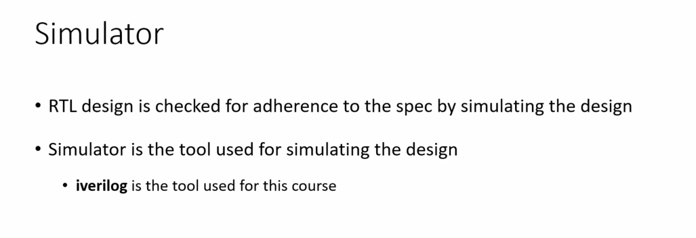
</div>

#### How Simulator Works:

##### 1. Parsing & Compilation
- Reads your code (Verilog/VHDL) and checks syntax.
- Converts design into an internal model.

##### 2. Elaboration
- Resolves module hierarchy and signal connections.
- Sets initial values for all signals.

##### 3. Simulation (Event-Driven)
- Signals are updated only when inputs change.
- Changes propagate through the circuit based on logic and delays.

##### 4. Output & Waveforms
- Records signal values over time.
- Shows results via text or waveform viewer.
<div align="center">
  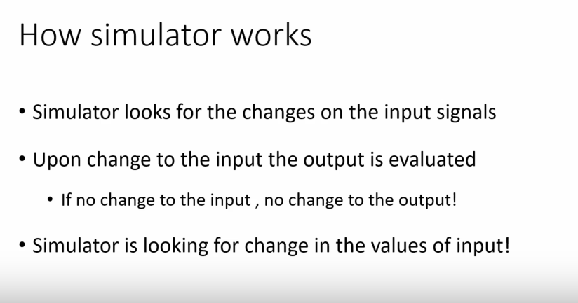
</div>
---

#### . Testbench and Its Working

#### What is a Testbench?
- A **testbench** is a simulation environment used to **verify and validate** a design (DUT – Design Under Test).
- It is **not synthesized into hardware**; it only exists for testing in simulation.
- Acts like a **virtual lab**, applying inputs and checking outputs of the design.
<div align="center">
  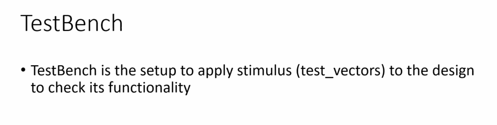
</div>
---

#### How a Testbench Works
1. **Instantiate DUT**  
   - The testbench creates an instance of the design module to be tested.

2. **Generate Stimulus (Inputs)**  
   - Provides different input patterns (clock, reset, test signals) to the DUT.

3. **Monitor Outputs**  
   - Captures and observes the DUT outputs for correctness.

4. **Check/Verify Results**  
   - Compares DUT output with the expected output (using assertions or manual checks).

5. **Display Results**  
   - Uses `$display`, `$monitor`, or waveform viewers to show simulation behavior.

## Key Points
- A testbench usually includes **clock generation, reset logic, input stimulus, and output checking**.
- It helps detect errors **early in simulation** before going to hardware.
<div align="center">
  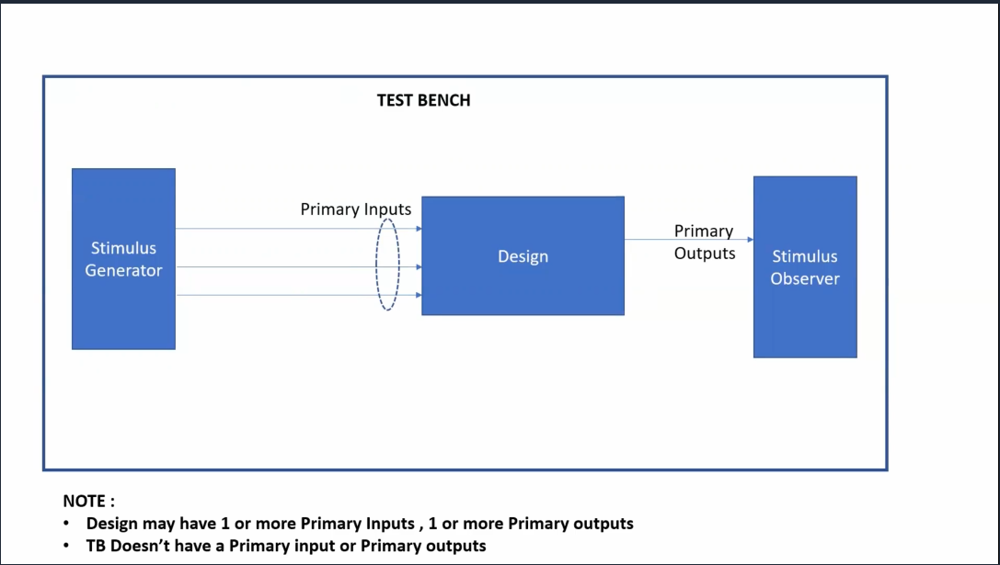
</div>
---

#### .Design
I put lecture screenshot for defining Design 
<div align="center">
  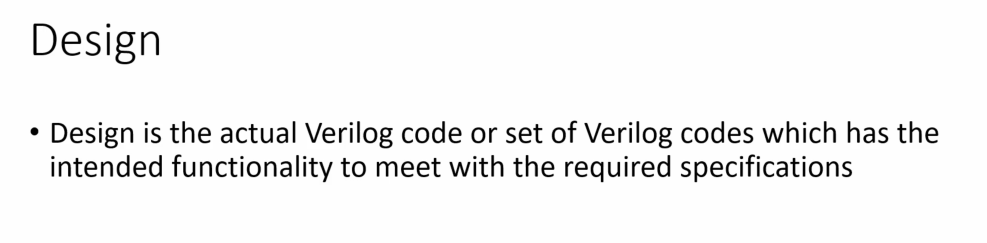
</div

----

#### . Iverilog Based simulation Flow
In Iverilog Based simulation flow we provide verilog file and testbench file as a input to a iverilog and it dumped file in vcd and that file we can analyse in gtkwave
<div align="center">
  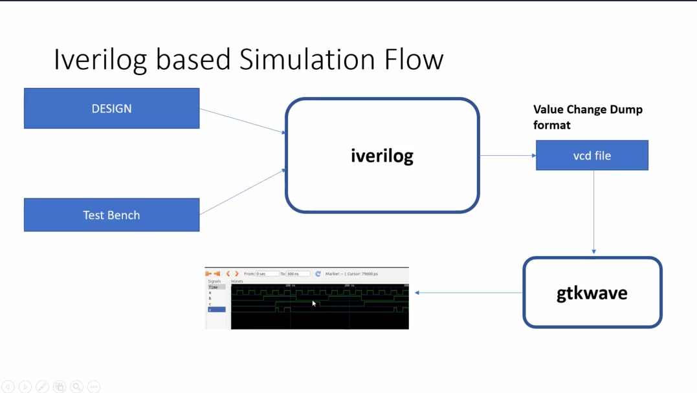
</div 
---

## Lab Setup 

### Lab1 
Make seprate folder for saving our whole lab work in one folder 
```shell
mkdir VSD/VLSI
```

####  Step 1: Clone the Workshop Repository

```shell
git clone https://github.com/kunalg123/sky130RTLDesignAndSynthesisWorkshop.git
cd sky130RTLDesignAndSynthesisWorkshop/verilog_files
```
####  Step 2: Install Required Tools

install these tool if you didnt install in day 0 work 
if you then ignore this part
```shell
sudo apt install iverilog
sudo apt install gtkwave
```
----

### Lab2 

In lab2 we learn how to operate and what are the command to run iverilog and gtk wave tool with on example 
Here are steps:
we taken exapmle of good_mux verilog file 
1.Compile the design and testbench:
```shell
iverilog good_mux.v tb_good_mux.v
```
2.Run the simulation:

```shell
./a.out
```
3.View the waveform:

```shell
gtkwave tb_good_mux.vcd
```
<div align="center">
  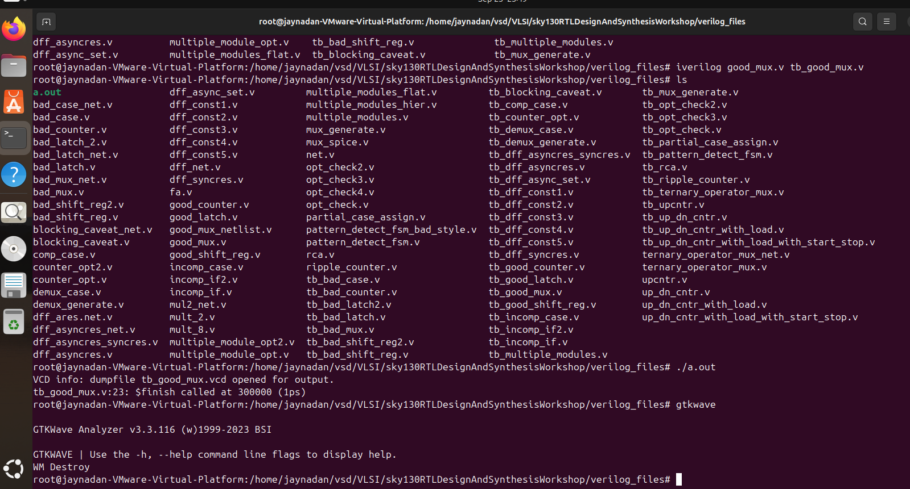
</di
<div align="center">
  
</div>
---

 4. Verilog Code Analysis

**The code for the multiplexer (`good_mux.v`):**

```verilog
module good_mux (input i0, input i1, input sel, output reg y);
always @ (*)
begin
    if(sel)
        y <= i1;
    else 
        y <= i0;
end
endmodule
```

####  **How It Works**

- **Inputs:** `i0`, `i1` (data), `sel` (select line)
- **Output:** `y` (registered output)
- **Logic:** If `sel` is 1, `y` gets `i1`; if `sel` is 0, `y` gets `i0`.

---

## . Introduction to Yosys & Gate Libraries

### What is Yosys?
**Yosys** is an open-source tool used for **logic synthesis** of digital circuits.  
It translates Verilog designs into a **gate-level netlist**, which acts like a blueprint of the actual hardware implementation.

#### Key Capabilities of Yosys
- **Logic Synthesis:** Turns HDL code into interconnected logic gates.  
- **Design Optimization:** Refines circuits for better speed, area, or power.  
- **Technology Mapping:** Maps generic logic onto specific hardware library cells.  
- **Formal Verification:** Ensures design correctness through checks.  
- **Flexible Extensions:** Can be integrated into custom flows and EDA tools.  

---

### Why Do Libraries Have Multiple Gate Variants?
Standard cell libraries (`.lib` files) don’t just provide one type of gate—they usually offer **several versions of the same gate** (AND, OR, NOT, etc.) with different characteristics.  

Some factors that distinguish these gate variants include:
- **Speed:** High-performance gates for time-critical paths.  
- **Power Consumption:** Low-power options to save energy.  
- **Area:** Compact cells to minimize chip size.  
- **Drive Strength:** Stronger cells to handle larger loads.  
- **Noise & Integrity:** Special cells to maintain signal quality.  
- **Mapping Flexibility:** Gives synthesis tools options to balance trade-offs.  

---

👉 In short, Yosys performs the **conversion and optimization**, while the gate libraries provide the **building blocks in different “flavors”** to match design needs.

---
### Here are some Golden Key Point About this topic well explained and by Teacher here i am attaching for my revision purpose in future i can refresh my concept

<div align="center">
  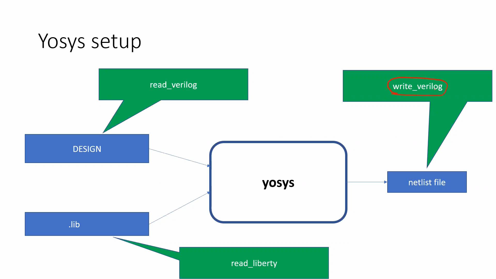
</div>
<div align="center">
  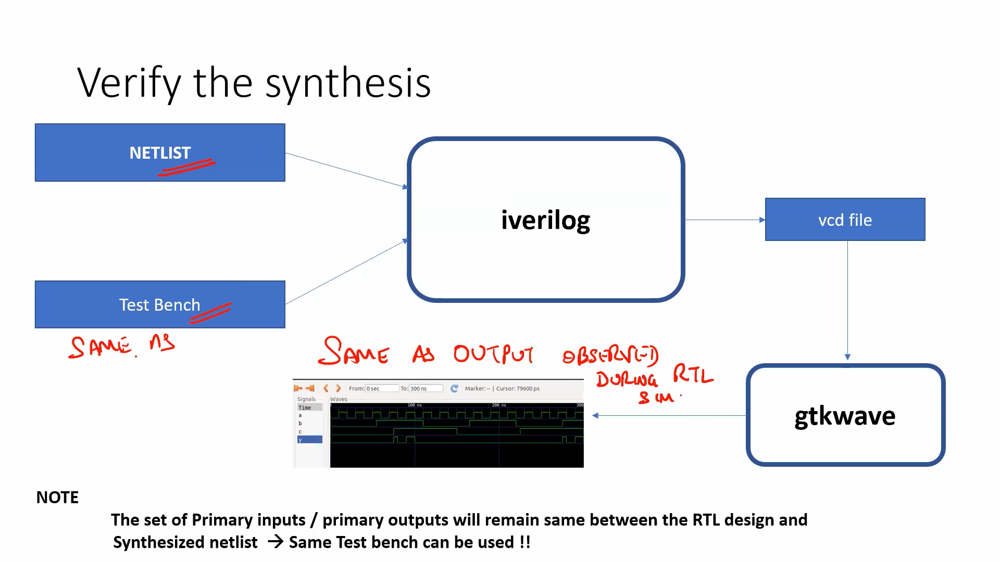
</div>
<div align="center">
  
</div>
<div align="center">
  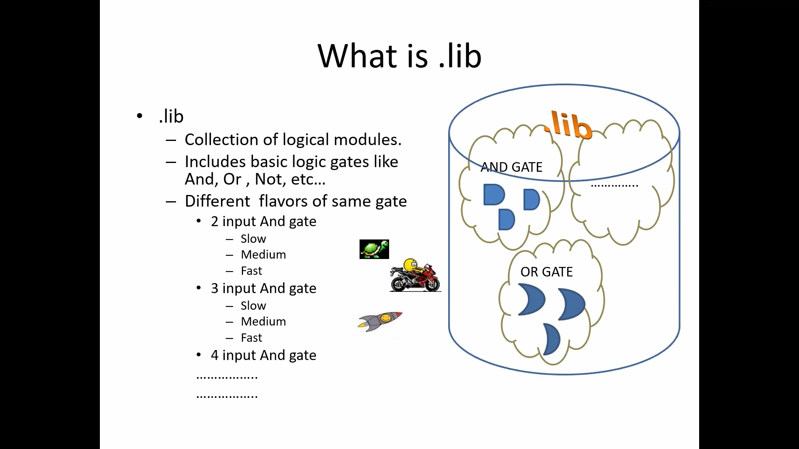
</div>
<div align="center">
  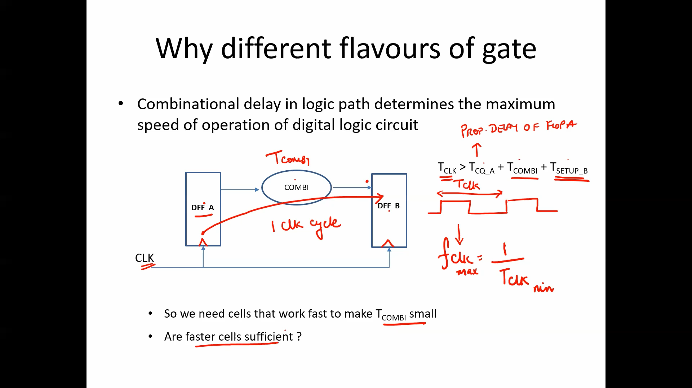
</div>
<div align="center">
  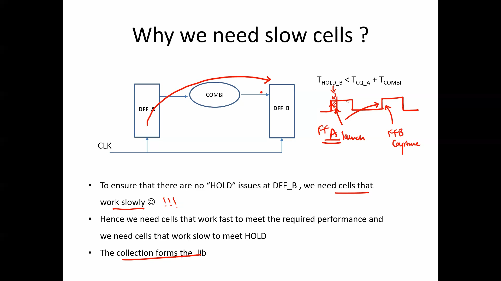
</div>
<div align="center">
  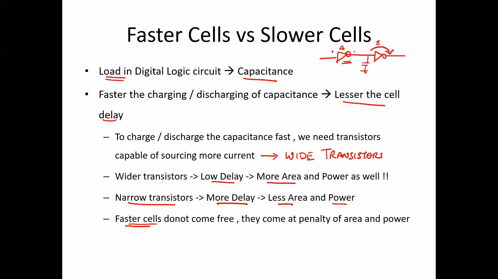
</div>
<div align="center">
  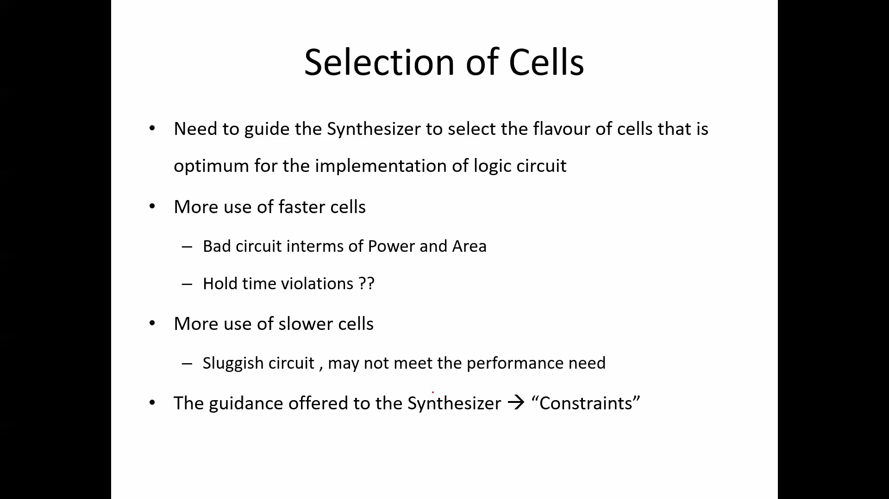
</div>
<div align="center">
  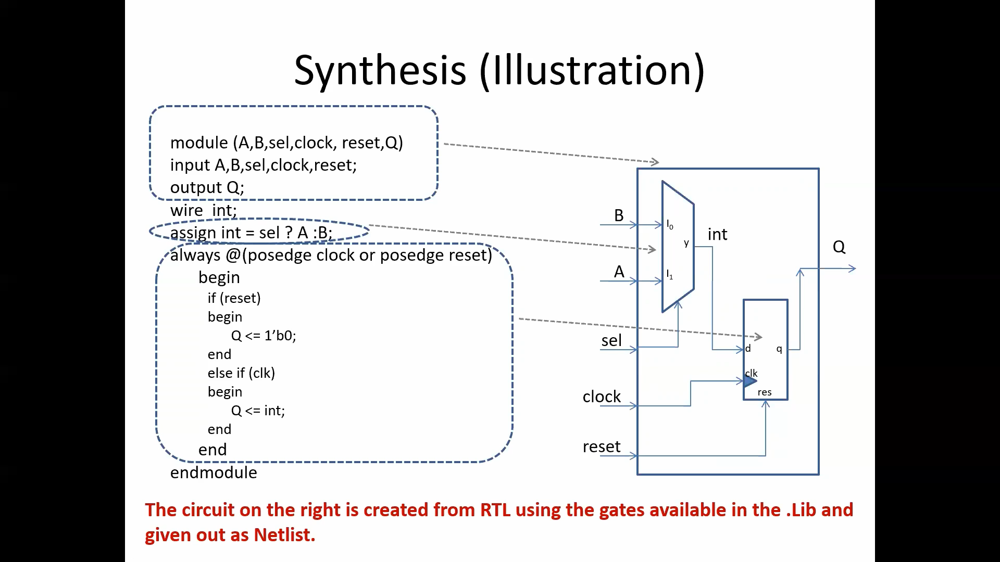
</div>


## . Synthesis Lab with Yosys

Let’s synthesize the `good_mux` design using Yosys!

###  Step-by-Step Yosys Flow


1. **Start Yosys**
   inside your  this adress where we clone our sky130 lab package /home/jaynadan/vsd/VLSI/sky130RTLDesignAndSynthesisWorkshop/verilog_files
   start yosis 
    ```shell
    yosys
    ```

3. **Read the liberty library**
    ```shell
    read_liberty -lib ..lib/sky130/file/sky130_fd_sc_hd__tt_025C_1v80.lib
    ```
    Note:- everyone can have in different folder so check according to that where .lib file existing 

4. **Read the Verilog code**
    ```shell
    read_verilog /home/vsd/VLSI/sky130RTLDesignAndSynthesisWorkshop/verilog_files/good_mux.v
    ```

5. **Synthesize the design**
    ```shell
    synth -top good_mux
    ```

6. **Technology mapping**
    ```shell
    abc -liberty ..lib/sky130/file/sky130_fd_sc_hd__tt_025C_1v80.lib
    ```

7. **Visualize the gate-level netlist**
    ```shell
    show
    ```

<div align="center">
  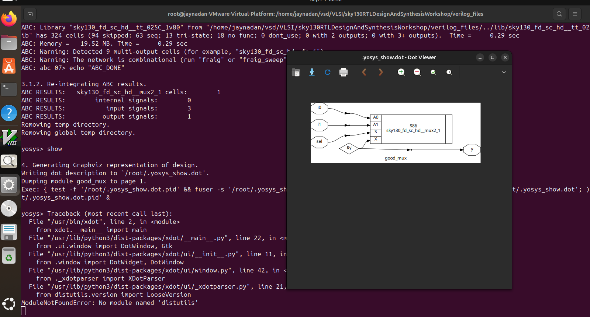
</div>

---
## 7. Summary

- We explored how **simulators** work and why they are essential in testing digital designs.  
- We understood the role of a **testbench** and how it drives and verifies a design in simulation.  
- We performed our **first Verilog simulation** using `iverilog` and observed outputs through waveforms.  
- We broke down the working of a **Good_Mux** and analyzed its Verilog code.  
- We got introduced to **Yosys**, learning how it performs synthesis and how different **gate library flavors** help balance speed, power, and area.
---

#### Thats all what we learned in day 1 

I attended every lecture in time but due to health issues i wasnt able to write github notes on that day itself but i was consistent everyday and did my all task everyday 
## I am so much thankful to teacher who clear our such concept in this much easy way i dont care if i will be selcetd for top 50 or 20 but what i am getting from this course is in itself is a gold for student like us so much thank you sir for your great knowledge i dont have word for expressing thanks to you you are really gems sir once more thank you sir 
