# Day 2 – Timing Libraries, Hierarchical vs Flat Synthesis, and Efficient Flop Coding Styles
Author: Jaynandan Kushwaha  
 ---- 

## 📌Introduction
Day 2 takes us deeper into the practical aspects of synthesis and optimization.  
We begin by understanding **timing libraries** and how they shape the translation of RTL into gate-level designs.  
Next, we explore the differences between **hierarchical and flat synthesis**, examining how design structure impacts performance and optimization.  
Finally, we dive into **flop coding styles** and learn how subtle changes in coding can lead to big differences in **timing, power, and area efficiency**.  

This day is all about gaining insights into the “behind-the-scenes” mechanisms that guide synthesis tools and learning how to write RTL that works *with* the tools, not against them.

---

## 📚 Contents

### 🔹 1. Introduction to Timing Libraries
- 🧩 **Lab 1:** Exploring `.lib` Files – Part 1  
- 🧩 **Lab 2:** Diving Deeper into `.lib` Files – Part 2  
- 🧩 **Lab 3:** Advanced View of `.lib` Files – Part 3  

### 🔹 2. Hierarchical vs Flat Synthesis
- 🏗️ **Lab 4:** Understanding Hierarchical vs Flat Synthesis – Part 1  
- 🏗️ **Lab 5:** Comparing Hierarchical vs Flat Approaches – Part 2  

### 🔹 3. Flop Coding Styles & Optimization
- 🔄 **Lecture 1:** Why Flops Matter – Coding Styles (Part 1)  
- 🔄 **Lecture 2:** Flop Coding Styles in Depth (Part 2)  
- ⚙️ **Lab 6:** Flop Synthesis Simulations – Part 1  
- ⚙️ **Lab 7:** Flop Synthesis Simulations – Part 2  
- ✨ **Lecture 3:** Interesting Optimizations – Part 1  
- ✨ **Lecture 4:** Interesting Optimizations – Part 2  
---

## Introductio To Timing Libraries
In lab1, Lab2, Lab3 we understand the sky130 and explore it 
### SKY130 PDK Overview
The **SKY130 PDK** is an open-source Process Design Kit developed around SkyWater’s 130nm CMOS technology.  
It serves as the foundation for digital design, offering a collection of **standard cell libraries, device models, and timing information**.  
These libraries provide critical data such as **propagation delay, power consumption, capacitance, and process variation details**, which are required by synthesis and simulation tools to accurately represent real hardware behavior.  

In short, without timing libraries, the synthesis tool would not know how fast a gate is, how much power it consumes, or how it behaves under different voltage and temperature conditions.  

---

### Decoding `tt_025C_1v80` in SKY130 PDK
A common naming format you’ll see in library files is something like `tt_025C_1v80`. Let’s break it down:  

- **tt** → “Typical-Typical” process corner (standard transistor behavior).  
- **025C** → Temperature = 25°C, representing nominal operating temperature.  
- **1v80** → Core voltage of 1.8V, which is the nominal supply voltage for standard cells.  

This label tells us the **process, voltage, and temperature (PVT) conditions** under which the library data was characterized.  

---

### Why Different PVT Corners Matter
Real silicon doesn’t always behave the same. Manufacturing variations, supply fluctuations, and temperature changes can alter timing.  
That’s why libraries include multiple PVT corners, such as:  
- **ss_100C_1v60** → Slow process, 100°C, 1.6V (worst-case delay, high temp, low voltage).  
- **ff_n40C_1v95** → Fast process, -40°C, 1.95V (best-case delay, low temp, high voltage).  

By using different libraries, designers can **test robustness**, ensuring the chip works reliably across all real-world conditions.  

<div align="center">
  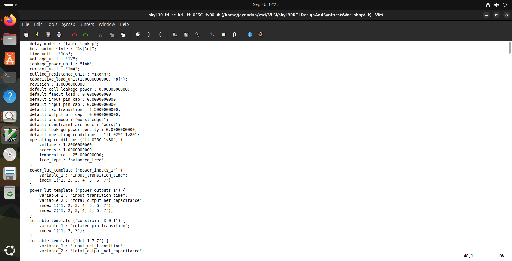
</div>
<div align="center">
  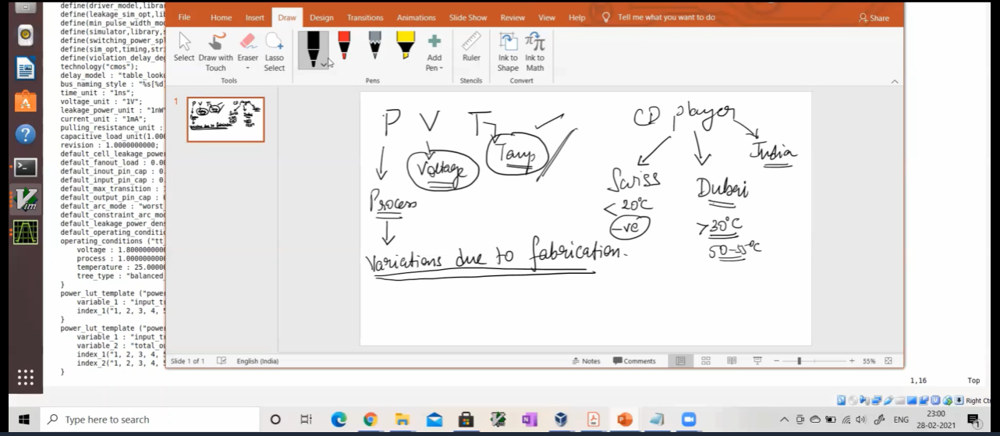
</div>
In this lecture they explain about Process Voltage and temprature how on these terms are important in silicon design work and this PVT tell how fast and slow our silicon will work 
---

In part 2 and 3 we discuss about verious information stored in .lib file technology used, volatge power leakage in cells and many more thing specially area how it differs on increasing cells in combinational ckt and about power leakage 

---

## Hierarchical vs Flat Synthesis

### Hierarchical Synthesis

**Overview:**  
Hierarchical synthesis is a design strategy where each module in the RTL is **synthesized individually**, maintaining the original hierarchy rather than flattening the design into a single block.

**Workflow:**  
Tools like **Yosys** handle each module separately. Using commands like `hierarchy`, the tool **maps out the structure of the design**, ensuring that module boundaries are preserved throughout the synthesis process.

**Benefits:**  
- **Speeds up synthesis** for large-scale designs by processing modules independently.  
- **Simplifies debugging**, as issues can be traced within individual modules.  
- **Supports modular design**, making it easier to integrate with other tools or IP blocks.

**Drawbacks:**  
- **Cross-module optimizations are limited**, which might reduce overall performance.  
- **Reports may require extra setup**, since hierarchical structures are not always captured automatically.
<div align="center">
  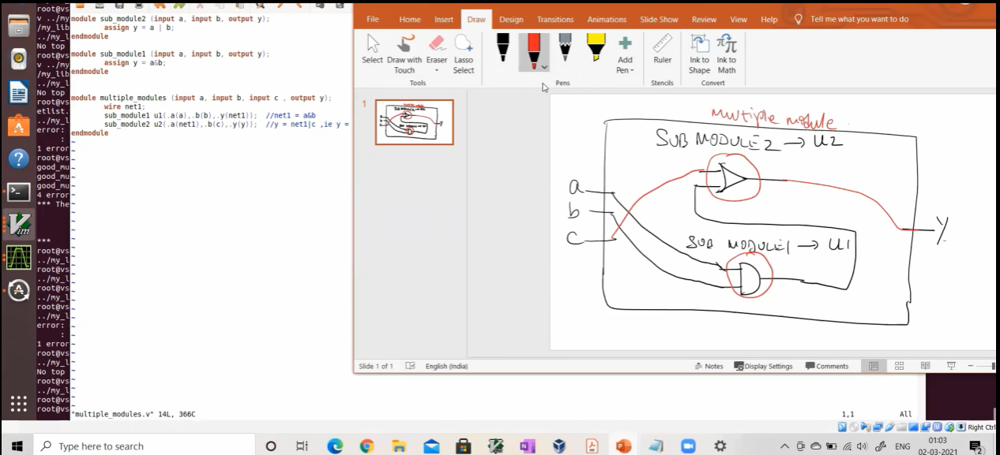
</div>
In this lecture they explain about multiple modules and how they work and how they will look after synthesis

#### Here is one exapmle we synthesis multipul module.v file and understand the synthesisation behind the tool

1. Start Yosys:
   ```shell
   yosys
   ```
2. Read Liberty library:
   ```shell
   read_liberty -lib ../lib/sky130_fd_sc_hd__tt_025C_1v80.lib
   ```
3. Read Verilog code:
   ```shell
   read_verilog multiple_modules.v
   ```
4. Synthesize:
   ```shell
   synth -top multiple_module
   ```
6. Technology mapping:
   ```shell
   abc -liberty ../lib/sky130_fd_sc_hd__tt_025C_1v80.lib
   ```
7. Visualize the gate-level netlist:
   ```shell
   show multiple_modules
   ```

<div align="center">
  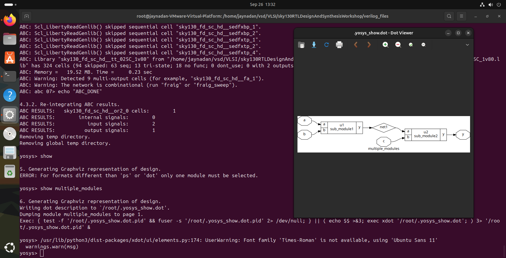
</div>
8. for generating heir.v file:

 ```shell
  write_verilog multiple_modules_hier.v
   ```
<div align="center">
  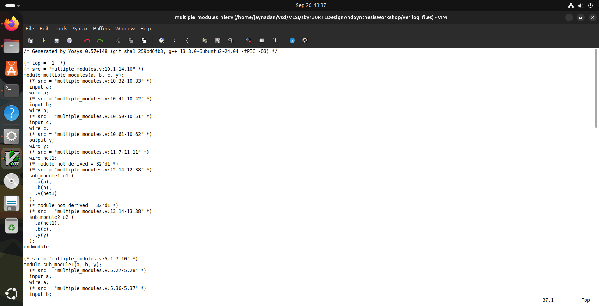
</div>
with the help of this file we try to understand what we assumed or design by our logic is that correct or not 
after this we flatten the design and see that design here is output 
<div align="center">
  
</div>

after comparing this we also see sub_module1 and submodule2 both submodule and see is they synthesise correct as sir explain in class 
<div align="center">
  
</div>
<div align="center">
  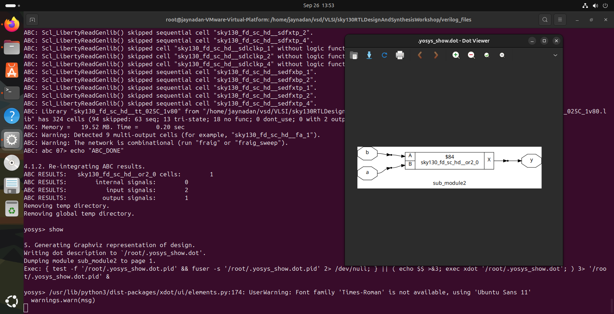
</div>


## Simulation and Synthesis Workflow

### Icarus Verilog Simulation

dff_asyncres

1. **Compile:**
   ```shell
   iverilog dff_asyncres.v tb_dff_asyncres.v
   ```
2. **Run:**
   ```shell
   ./a.out
   ```
3. **View Waveform:**
   ```shell
   gtkwave tb_dff_asyncres.vcd
   ```
<div align="center">
  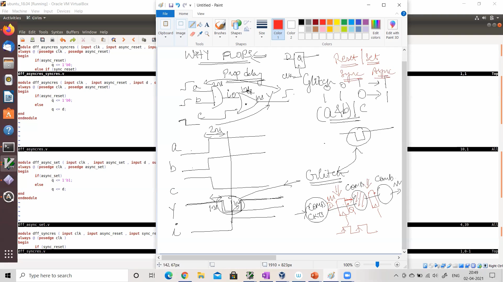
</div>
---

dff_asyncres_set

1. **Compile:**
   ```shell
   iverilog dff_asyncres_set.v tb_dff_asyncres_set.v
   ```
2. **Run:**
   ```shell
   ./a.out
   ```
3. **View Waveform:**
   ```shell
   gtkwave tb_dff_asyncres_set.vcd
   ```
<div align="center">
  
</div>

dff_synchrous


1. **Compile:**
   ```shell
   iverilog dff_syncres.v tb_dff_syncres.v
   ```
2. **Run:**
   ```shell
   ./a.out
   ```
3. **View Waveform:**
   ```shell
   gtkwave tb_dff_syncres.vcd
   ```
<div align="center">
  
</div>
---

### Synthesis with Yosys
dff_asyncres
1. Start Yosys:
   ```shell
   yosys
   ```
2. Read Liberty library:
   ```shell
   read_liberty -lib ../lib/sky130_fd_sc_hd__tt_025C_1v80.lib
   ```
3. Read Verilog code:
   ```shell
   read_verilog dff_asyncres.v
   ```
4. Synthesize:
   ```shell
   synth -top dff_asyncres
   ```
5. Map flip-flops:
   ```shell
   dfflibmap -liberty ../lib/sky130_fd_sc_hd__tt_025C_1v80.lib
   ```
6. Technology mapping:
   ```shell
   abc -liberty ../lib/sky130_fd_sc_hd__tt_025C_1v80.lib
   ```
7. Visualize the gate-level netlist:
   ```shell
   show
   ```
<div align="center">
  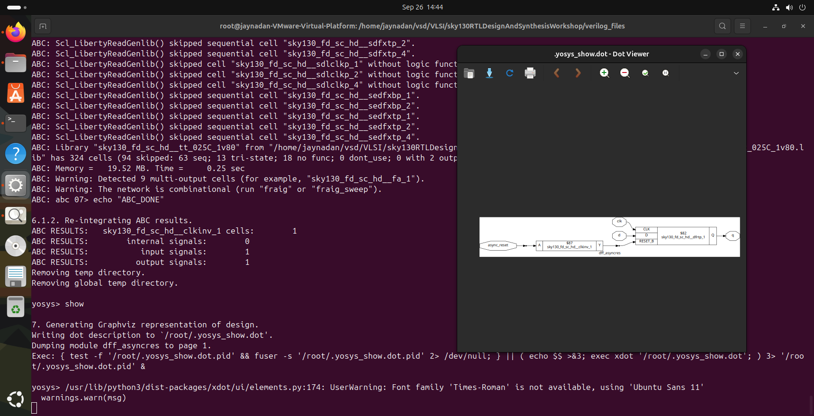
</div> 

---

dff_assyncruns-set

1. Start Yosys:
   ```shell
   yosys
   ```
2. Read Liberty library:
   ```shell
   read_liberty -lib ../lib/sky130_fd_sc_hd__tt_025C_1v80.lib
   ```
3. Read Verilog code:
   ```shell
   read_verilog dff_async_set.v
   ```
4. Synthesize:
   ```shell
   synth -top dff_async_set
   ```
5. Map flip-flops:
   ```shell
   dfflibmap -liberty ../lib/sky130_fd_sc_hd__tt_025C_1v80.lib
   ```
6. Technology mapping:
   ```shell
   abc -liberty ../lib/sky130_fd_sc_hd__tt_025C_1v80.lib
   ```
7. Visualize the gate-level netlist:
   ```shell
   show
   ```
<div align="center">
  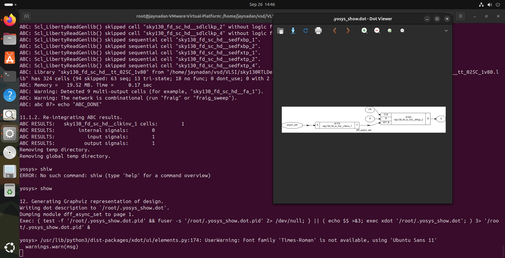
</div>  

---

dff-

1. Start Yosys:
   ```shell
   yosys
   ```
2. Read Liberty library:
   ```shell
   read_liberty -lib ../lib/sky130_fd_sc_hd__tt_025C_1v80.lib
   ```
3. Read Verilog code:
   ```shell
   read_verilog dff_asyncres.v
   ```
4. Synthesize:
   ```shell
   synth -top dff_asyncres
   ```
5. Map flip-flops:
   ```shell
   dfflibmap -liberty ../lib/sky130_fd_sc_hd__tt_025C_1v80.lib
   ```
6. Technology mapping:
   ```shell
   abc -liberty ../lib/sky130_fd_sc_hd__tt_025C_1v80.lib
   ```
7. Visualize the gate-level netlist:
   ```shell
   show
   ```
<div align="center">
  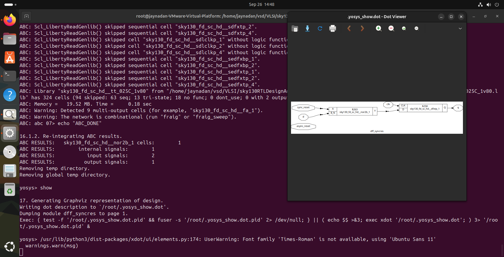
</div>  

### Intresting Optimisation
Mul2
1. Start Yosys:
   ```shell
   yosys
   ```
2. Read Liberty library:
   ```shell
   read_liberty -lib ../lib/sky130_fd_sc_hd__tt_025C_1v80.lib
   ```
3. Read Verilog code:
   ```shell
   read_verilog mult_2.v
   ```
4. Synthesize:
   ```shell
   synth -top mul2
   ```

5. Technology mapping:
   ```shell
   abc -liberty ../lib/sky130_fd_sc_hd__tt_025C_1v80.lib
   ```
6. Visualize the gate-level netlist:
   ```shell
   show
   ```
<div align="center">
  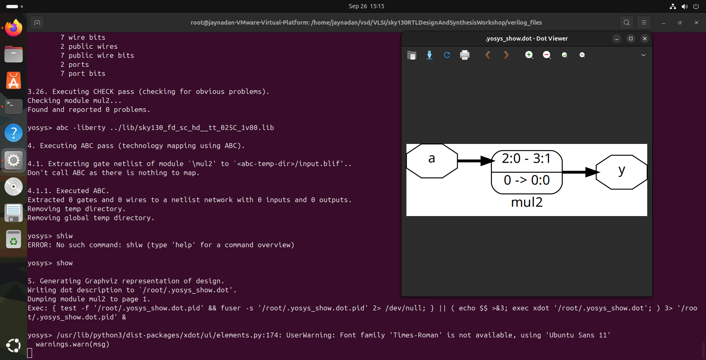
</div>  

Mul8
1. Start Yosys:
   ```shell
   yosys
   ```
2. Read Liberty library:
   ```shell
   read_liberty -lib ../lib/sky130_fd_sc_hd__tt_025C_1v80.lib
   ```
3. Read Verilog code:
   ```shell
   read_verilog mult_8.v
   ```
4. Synthesize:
   ```shell
   synth -top mult8
   ```

5. Technology mapping:
   ```shell
   abc -liberty ../lib/sky130_fd_sc_hd__tt_025C_1v80.lib
   ```
6. Visualize the gate-level netlist:
   ```shell
   show
   ```
<div align="center">
  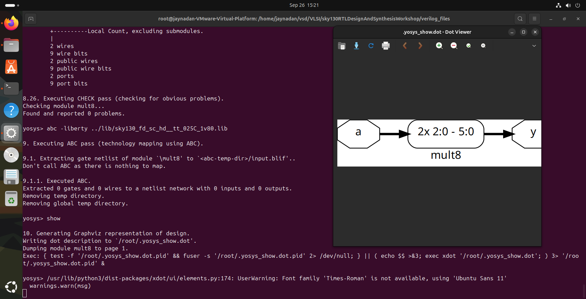
</div> 
---

## Summary

This guide has covered key aspects of **RTL design and synthesis**, offering practical insights into **timing libraries, synthesis methodologies, and flip-flop coding styles**.  

- **Timing Libraries:** Understanding different process corners, voltage, and temperature variations helps ensure that your design meets performance and reliability requirements.  
- **Synthesis Strategies:** Hierarchical and flattened synthesis approaches provide flexibility in optimizing design speed, area, and debugability. Choosing the right approach depends on the size and complexity of your design.  
- **Flip-Flop Coding Practices:** Proper coding of asynchronous and synchronous flip-flops ensures predictable behavior, avoids glitches, and supports robust sequential circuit design.

By exploring and experimenting with these concepts, you can **improve your RTL design skills**, write cleaner code, and make your designs more efficient, modular, and easier to debug. This foundation will help you confidently tackle **complex digital systems** and optimize them for real-world applications.

