# Day 3 – Combinational and Sequential Optimizations
**Author:** Jaynandan Kushwaha

## 📌 **Introduction**  

Day 3 focuses on **optimizing digital designs** at both the combinational and sequential levels. Efficient optimization techniques not only improve timing and performance but also reduce area and power consumption.  

We start with an introduction to basic optimization principles, understanding how synthesis tools identify opportunities for improvement. Then, we explore **combinational logic optimizations**, learning strategies to simplify and speed up logic paths. After that, we dive into **sequential logic optimizations**, including efficient flip-flop usage and techniques for handling unused outputs.  

By the end of this day, you will gain practical knowledge of optimization methods that make RTL designs **faster, smaller, and more reliable**, and learn how to apply these techniques during synthesis and simulation.

---

## 📚 **Contents**  
---
🔹 1. Introduction to Optimizations  
🧩 Lecture 1: Introduction to Optimizations – Part 1  
🧩 Lecture 2: Introduction to Optimizations – Part 2  
🧩 Lecture 3: Introduction to Optimizations – Part 3  

🔹 2. Combinational Logic Optimizations  
⚡ Lab 1: Combinational Logic Optimisations – Part 1  
⚡ Lab 2: Combinational Logic Optimisations – Part 2  

🔹 3. Sequential Logic Optimizations  
🔄 Lab 3: Sequential Logic Optimisations – Part 1  
🔄 Lab 4: Sequential Logic Optimisations – Part 2  
🔄 Lab 5: Sequential Logic Optimisations – Part 3  

🔹 4. Sequential Optimizations for Unused Outputs  
✨ Lab 6: Sequential Optimisation for Unused Outputs – Part 1  
✨ Lab 7: Sequential Optimisation for Unused Outputs – Part 2

---

# Introduction about Loguc Optimisation

## Combinational Logic Optimisation

**Overview:**  
Constant propagation is an **optimization technique** used during synthesis where variables assigned a fixed value are directly replaced with that constant. This eliminates unnecessary logic and makes the circuit leaner and more efficient.

**How It Works:**  
The synthesis tool scans the RTL code to detect signals or variables that always hold a **constant value**. Instead of preserving them as separate operations, the tool substitutes the constant directly into the logic. This often leads to removal of redundant gates or even entire portions of unused circuitry.

**Key Benefits:**  
- **Simplified Logic:** Reduces the design complexity by cutting down unnecessary operations.  
- **Performance Gains:** Shorter logic paths result in faster execution and reduced delay.  
- **Resource Efficiency:** Minimizes the number of gates and flip-flops required, saving both area and power.  

Constant propagation is a small optimization step, but it plays a **big role in streamlining designs**, making circuits more compact and improving overall synthesis quality.
<div align="center">
  
</div> 

### Explanation of type of Combinational logic
#### Constant Propagation in Combinational Optimization

**Concept:**  
In combinational optimization, **constant propagation** is the process of detecting inputs or signals that always evaluate to a fixed value (0 or 1) and replacing them directly in the logic. By doing this, synthesis tools can eliminate unnecessary gates and simplify the overall circuit.

**How It Works:**  
- The synthesis tool scans through combinational logic equations.  
- If a variable or expression is tied to a constant value, that constant is directly substituted.  
- This substitution often leads to removal of redundant gates and collapsing of logic paths.  

<div align="center">
  
</div>

---


#### Boolean Simplification in Combinational Optimization

**Concept:**  
Boolean simplification is the process of reducing logic expressions using **Boolean algebra rules** without changing their functionality. The goal is to minimize the number of logic gates, reduce circuit complexity, and improve performance.

**How It Works:**  
- The synthesis tool applies Boolean identities (like absorption, De Morgan’s theorem, distributive law, etc.) to simplify equations.  
- Equivalent but **smaller logic expressions** replace the original design.  
- This leads to fewer gates in the final netlist and optimized timing paths.  
<div align="center">
  
</div>

---

## Sequential Optimization

**Concept:**  
Sequential optimization deals with improving circuits that use **storage elements** such as flip-flops and registers. Unlike combinational logic, sequential circuits rely on both current inputs and stored states, so the focus here is on reducing unnecessary registers, improving timing, and making the design more efficient.

**How It Works:**  
- **Redundancy Removal:** Identifies flip-flops or registers that do not contribute to the final output or always hold a constant value, and removes them.  
- **State Minimization:** Simplifies state machines by merging equivalent or unreachable states.  
- **Retiming:** Redistributes flip-flops across the design to balance delay, shorten the critical path, and improve clock speed.  
- **Unused Outputs:** Detects sequential elements whose outputs are never used and eliminates them to save resources.  

**Benefits of Sequential Optimization:**  
- **Reduced Area and Power:** Fewer flip-flops and registers mean smaller designs with lower power consumption.  
- **Improved Performance:** Retiming balances logic delays, enabling higher clock frequencies.  
- **Cleaner Design:** Removes unused or redundant sequential logic, making the design easier to analyze and verify.  

Sequential optimization is especially valuable in **large RTL systems**, where careful management of storage elements can significantly improve both **efficiency and reliability** of the overall design.

<div align="center">
  
</div>

---

Exaple to explain Sequantial 
<div align="center">
  
</div>
<div align="center">
  
</div>

---

## Key Sequential Optimization Techniques

### 1. State Optimization
**Definition:**  
State optimization is the process of reducing the number of states in a **finite state machine (FSM)** without changing its functionality.  

**How it Works:**  
- Identifies **equivalent states** that produce the same outputs and transitions, then merges them.  
- Removes **unreachable states** that cannot be activated under any input condition.  

**Benefits:**  
- Smaller state machines → fewer flip-flops.  
- Reduced complexity → faster synthesis and verification.  
- Lower area and power consumption.

---

### 2. Cloning
**Definition:**  
Cloning is the duplication of a sequential element (like a flip-flop or register) to reduce fanout and improve timing performance.  

**How it Works:**  
- When a single register drives too many loads (high fanout), it causes delay.  
- The tool **duplicates the register** so that loads are distributed across multiple drivers.  

**Benefits:**  
- Reduces load per register.  
- Improves timing closure by shortening critical paths.  
- Ensures more balanced signal distribution.

---

### 3. Retiming
**Definition:**  
Retiming is a technique where flip-flops are **moved across combinational logic** without changing the overall functionality, to balance delay and improve performance.  

**How it Works:**  
- Analyzes logic paths and identifies imbalances in delay.  
- Shifts registers forward or backward across logic gates to reduce the **critical path delay**.  

**Benefits:**  
- Enables higher clock frequencies.  
- Balances timing across pipeline stages.  
- Improves overall circuit performance without changing logic behavior.

## . Labs on Optimization

### Lab 1

Below is the Verilog code for Lab 1:

```verilog
module opt_check (input a , input b , output y);
	assign y = a?b:0;
endmodule
```

**Explanation:**
- `assign y = a ? b : 0;` means:
  - If `a` is true, `y` is assigned the value of `b`.
  - If `a` is false, `y` is 0.
  
#### Output

<div align="center">
  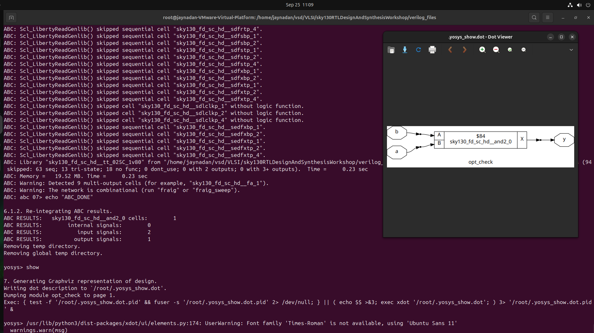
</div>

### Lab 2

Verilog code:

```verilog
module opt_check2 (input a , input b , output y);
	assign y = a?1:b;
endmodule
```

**Code Analysis:**
- Acts as a multiplexer:
  - `y = 1` if `a` is true.
  - `y = b` if `a` is false.

<div align="center">
  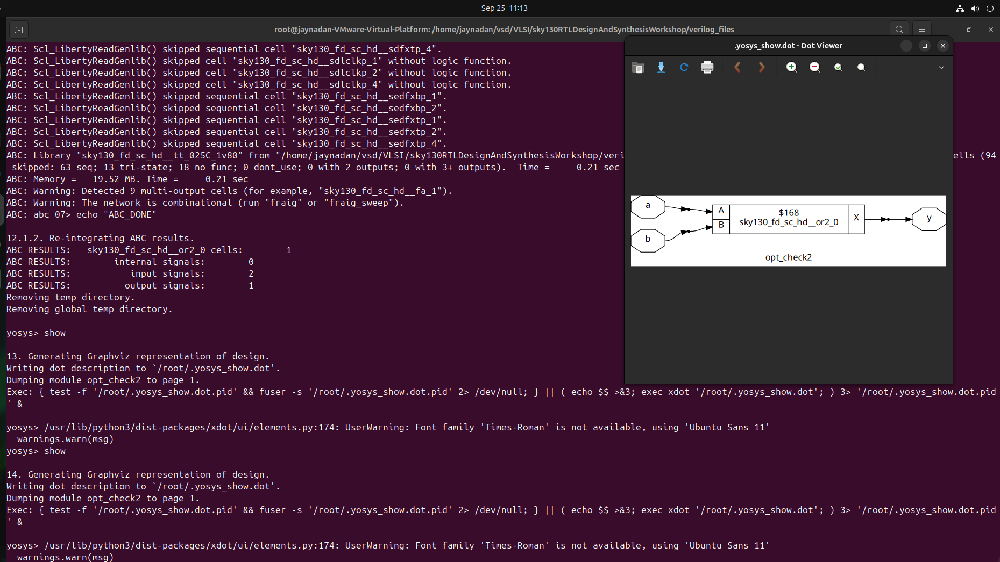
</div>

### Lab 3

Verilog code:

```verilog
module opt_check2 (input a , input b , output y);
	assign y = a?1:b;
endmodule
```

**Functionality:**  
2-to-1 multiplexer; `y = a ? 1 : b` (outputs `1` when `a` is true, otherwise `b`).
<div align="center">
  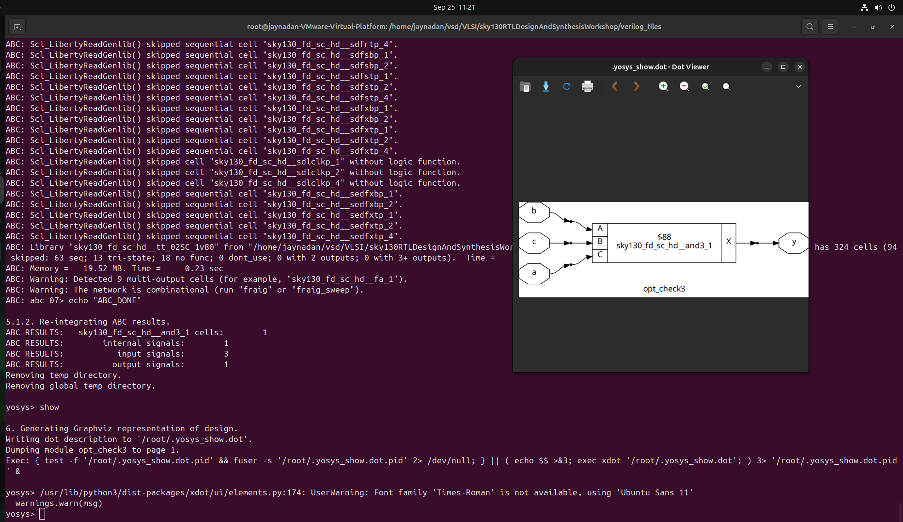
</div>

### Lab 4

Verilog code:

```verilog
module opt_check4 (input a , input b , input c , output y);
 assign y = a?(b?(a & c ):c):(!c);
 endmodule
```

**Functionality:**
- Three inputs (`a`, `b`, `c`), output `y`.
- Nested ternary logic:
  - If `a = 1`, `y = c`.
  - If `a = 0`, `y = !c`.
- Logic simplifies to:  
  `y = a ? c : !c`

<div align="center">
  
</div>
<div align="center">
  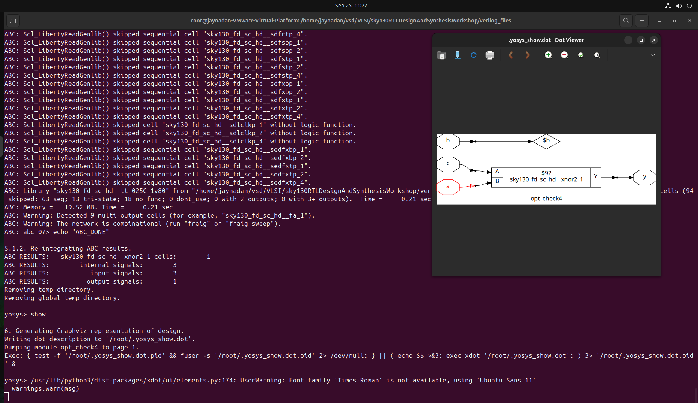
</div>

### Lab 5
Verilog code:

```verilog
module multiple_module_opt(input a , input b , input c , input d , output y);
wire n1,n2,n3;

sub_module1 U1 (.a(a) , .b(1'b1) , .y(n1));
sub_module2 U2 (.a(n1), .b(1'b0) , .y(n2));
sub_module2 U3 (.a(b), .b(d) , .y(n3));

assign y = c | (b & n1); 


endmodule
```
<div align="center">
  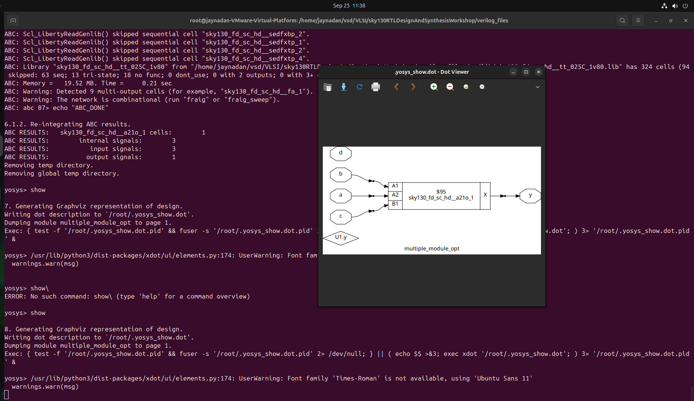
</div>

### Lab 6

#### dff-const-1
**Gtk-Wave Output** 

<div align="center">
  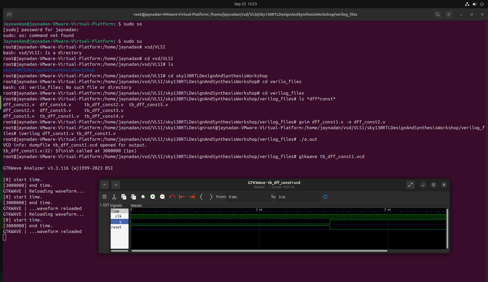
</div>

**Synthesis output**

<div align="center">
  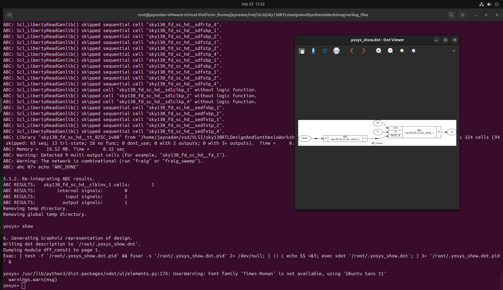
</div>

### Lab 7

#### dff-const-2
**Gtk-Wave Output** 

<div align="center">
  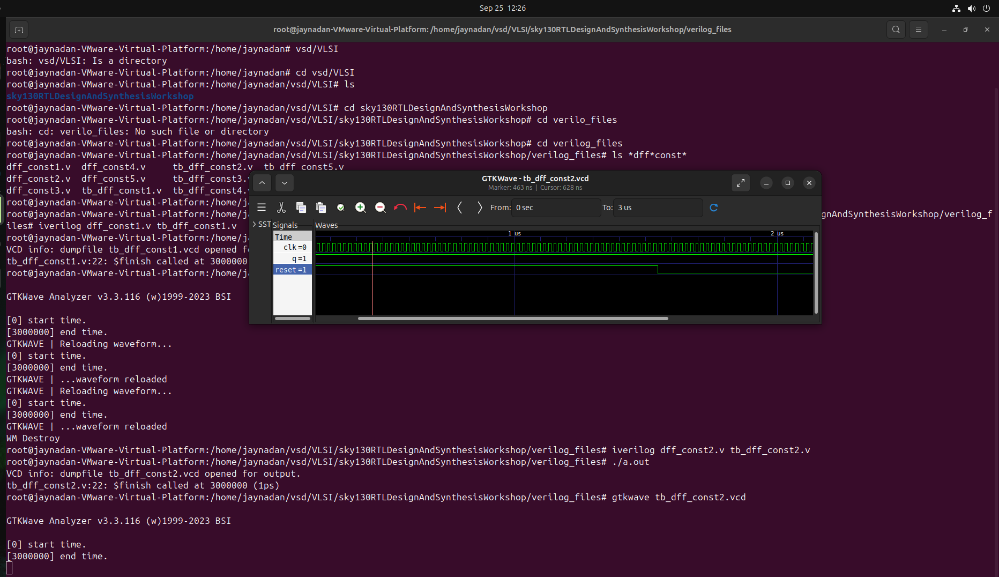
</div>

**Synthesis output**

<div align="center">
  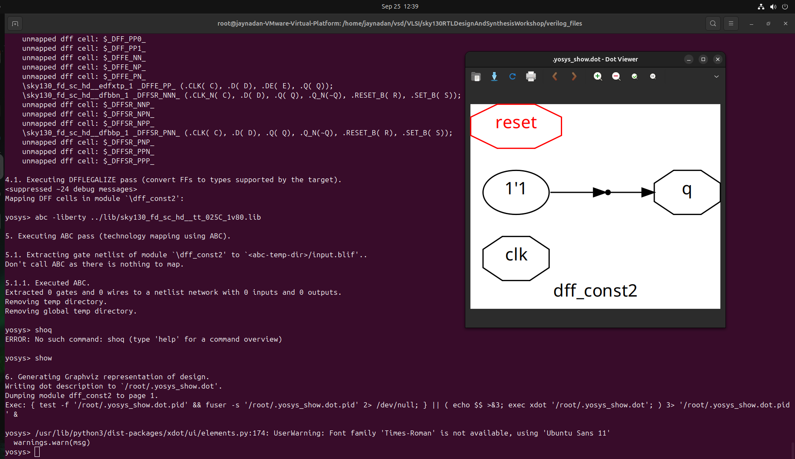
</div>

### Lab 8

#### dff-const-3
**Gtk-Wave Output** 

<div align="center">
  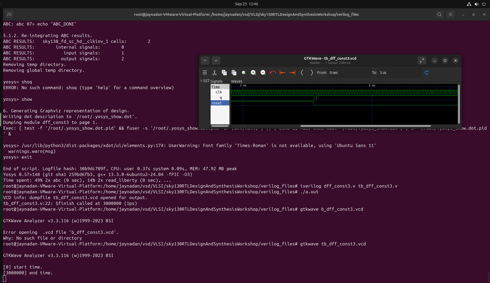
</div>

**Synthesis output**

<div align="center">
  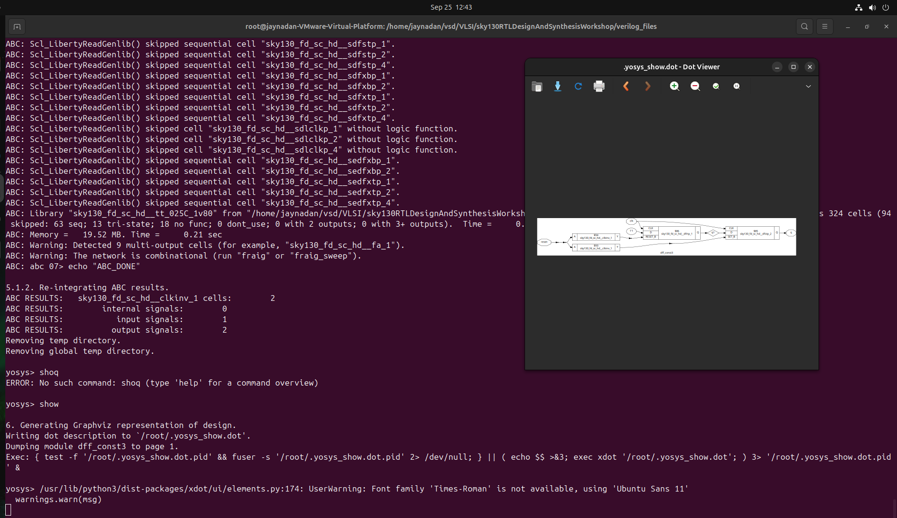
</div>

### Lab 9

#### dff-const-4
**Gtk-Wave Output** 

<div align="center">
  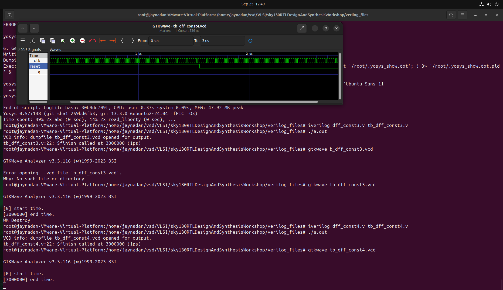
</div>

**Synthesis output**

<div align="center">
  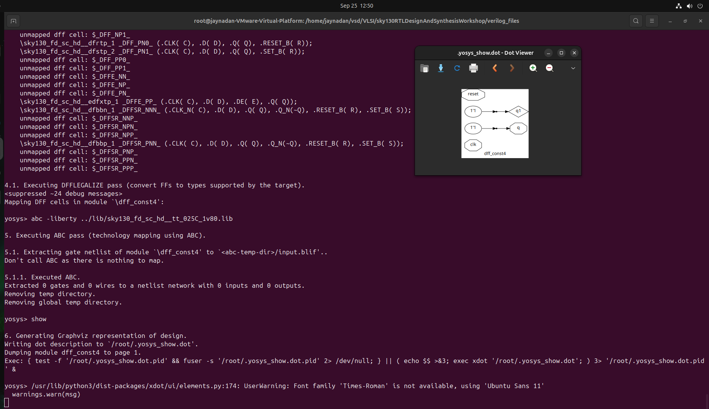
</div>

### Lab 10

#### dff-const-5
**Gtk-Wave Output** 

<div align="center">
  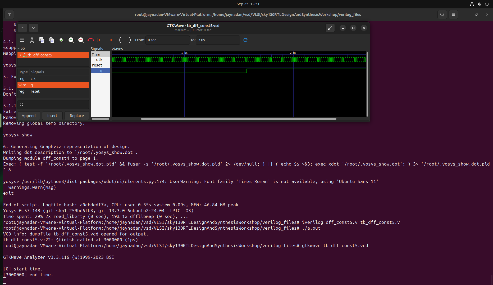
</div>

**Synthesis output**

<div align="center">
  
</div>

## Sequantial Unused output labs 

### Lab 11

#### COunter-opt
**Sunthesis** 

<div align="center">
  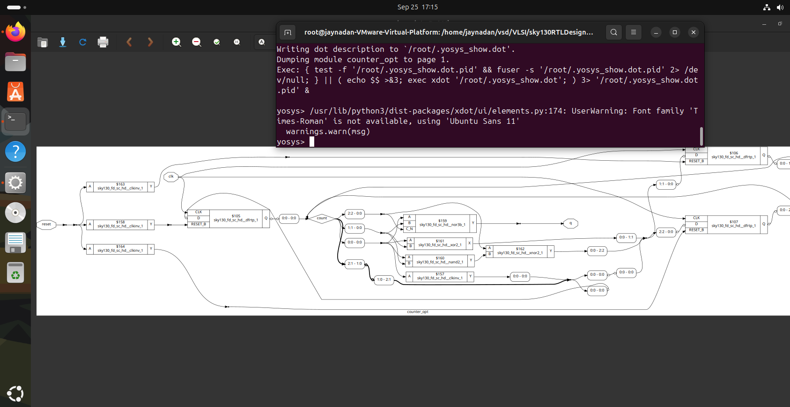
</div>

**Synthesis output**

<div align="center">
  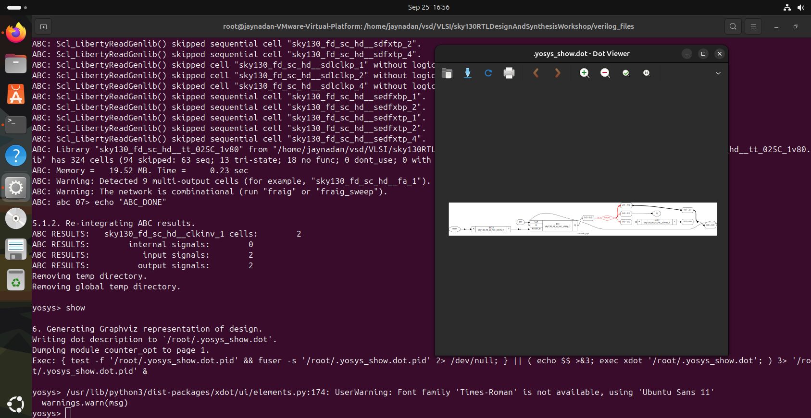
</div>

## Summary 

In this chapter, we explored the powerful techniques of **combinational and sequential optimizations** that help refine RTL designs into more efficient hardware.  

- On the **combinational side**, we looked at methods like **constant propagation** and **Boolean simplification**, which streamline logic expressions, remove redundant gates, and shorten critical paths. These optimizations directly improve circuit speed, reduce area, and lower power usage.  

- On the **sequential side**, we examined techniques such as **state optimization**, **cloning**, and **retiming**. These methods focus on storage elements and timing paths, aiming to reduce unnecessary registers, balance logic delays, and handle high-fanout issues effectively. Sequential optimizations are especially important for large-scale digital systems where timing closure and area efficiency are critical.  

Together, these optimization techniques demonstrate how synthesis tools not only translate RTL into gates but also **reshape and refine the design** to achieve better performance, smaller area, and improved power efficiency.  

This chapter builds the foundation for writing RTL that is not only functionally correct but also **optimized for real-world hardware implementation**.


