# Day 4 – Gate-Level Simulation (GLS), Blocking vs Non-Blocking, and Synthesis-Simulation Mismatch  
Author: Jaynandan Kushwaha  

---

## 📌 Introduction  
Day 4 takes us further into **post-synthesis verification** and the importance of writing RTL that works reliably in both simulation and hardware.  

We begin with **Gate-Level Simulation (GLS)**, which validates the netlist generated after synthesis. Then we move to **synthesis-simulation mismatch**, understanding how poor coding styles or tool differences can cause functional issues. Finally, we explore the difference between **blocking and non-blocking assignments in Verilog**, two fundamental concepts that affect whether logic is inferred as **combinational or sequential**.  

By the end of this day, you will understand not only how to simulate at the gate level but also how to write RTL that avoids mismatches and follows best practices.  

---

## 📚 Contents  

🔹 **1. Gate-Level Simulation (GLS)**  
   - Concept and Importance  
   - Why and When to Perform GLS  
   - Functional GLS vs Timing GLS  

🔹 **2. Synthesis-Simulation Mismatch**  
   - Causes and Consequences  
   - Best Practices to Avoid Mismatches  

🔹 **3. Blocking vs Non-Blocking in Verilog**  
   - 3.1 Blocking Assignments  
   - 3.2 Non-Blocking Assignments  
   - 3.3 Comparison Table  

⚙️ **4. Labs**  
   - Lab 1: Gate-Level Simulation Run  
   - Lab 2: Debugging Simulation-Synthesis Mismatches  
   - Lab 3: Exploring Blocking vs Non-Blocking Behavior  

✨ **5. Summary**  

---

## 🔹 1. Gate-Level Simulation (GLS)  

**GLS** verifies the **gate-level netlist** produced after synthesis. Unlike RTL simulation, which runs on high-level code, GLS confirms that the **synthesized hardware representation** behaves as expected.  

### Why GLS?  
- ✅ Ensures that synthesis preserved functional correctness.  
- ✅ Validates timing with real delays from standard delay format (SDF).  
- ✅ Checks test logic such as scan chains.  

### When GLS is Done?  
- After **synthesis**, to confirm the design is correctly mapped.  
- Before **physical design**, to catch issues early.  

### Types of GLS  
- **Functional GLS**: Zero/unit delay simulation for logical correctness.  
- **Timing GLS**: Delay-annotated simulation for realistic timing checks.
<div align="center">
  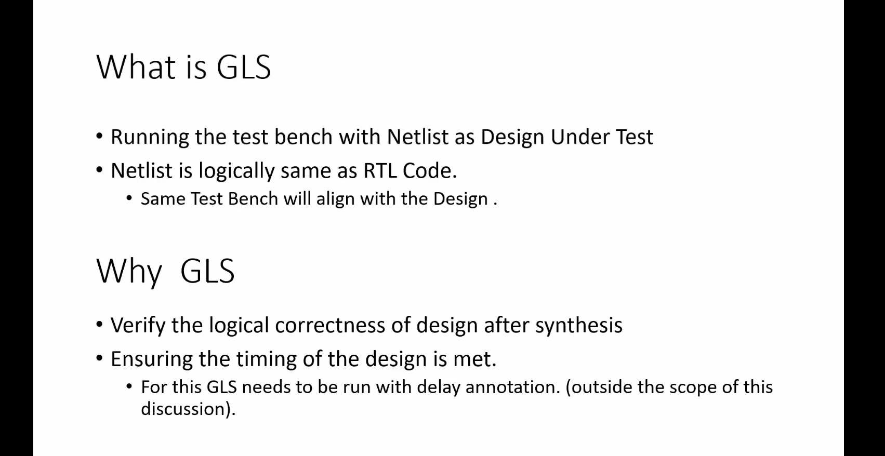
</div>
<div align="center">
  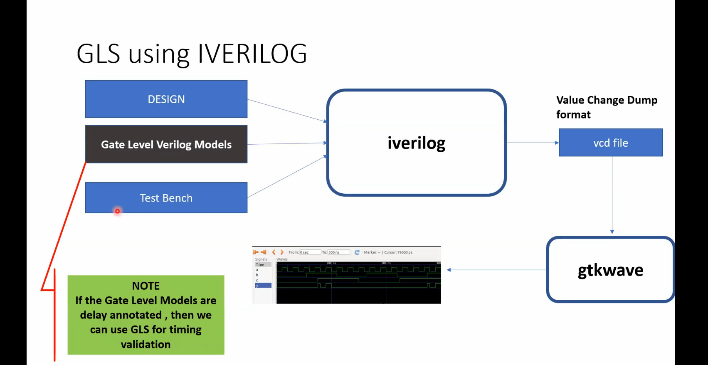
</div>
<div align="center">
  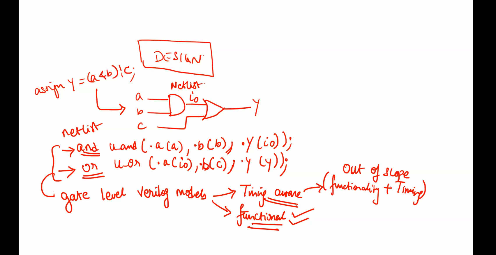
</div>


---

## 🔹 2. Synthesis-Simulation Mismatch / Caveat 

A **synthesis-simulation mismatch** occurs when results from RTL simulation differ from those of gate-level simulation or real silicon.  

### Causes:  
- ❌ Use of **non-synthesizable constructs** (delays, initial blocks, etc.).  
- ❌ **Incomplete coding**, such as missing `else` or incorrect sensitivity lists.  
- ❌ **Ambiguity** in RTL that synthesis and simulation tools interpret differently.  

### Best Practices:  
- Write **synthesizable, tool-friendly RTL**.  
- Avoid constructs that simulators accept but synthesis ignores.  
- Always test with clear, deterministic coding styles.  
<div align="center">
  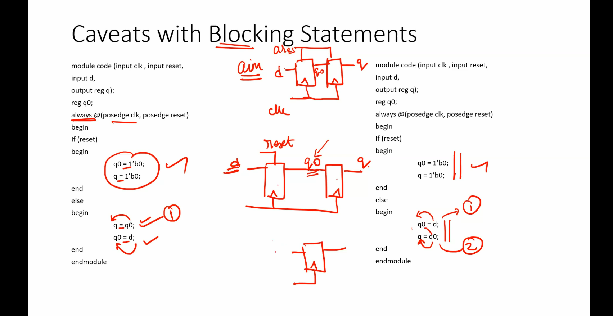
</div>

---

## 🔹 3. Blocking vs Non-Blocking in Verilog  

Assignments in Verilog fall into two categories:  

### 3.1 Blocking Assignments  
- Executed immediately, in sequential order.  
- Best suited for **combinational logic**.  
- Simple and direct, but can cause incorrect behavior if used in sequential circuits.  

### 3.2 Non-Blocking Assignments  
- Executed concurrently at the end of a time step.  
- Best suited for **sequential logic**, such as registers and flip-flops.  
- Ensures predictable behavior in clocked systems.

  <div align="center">
  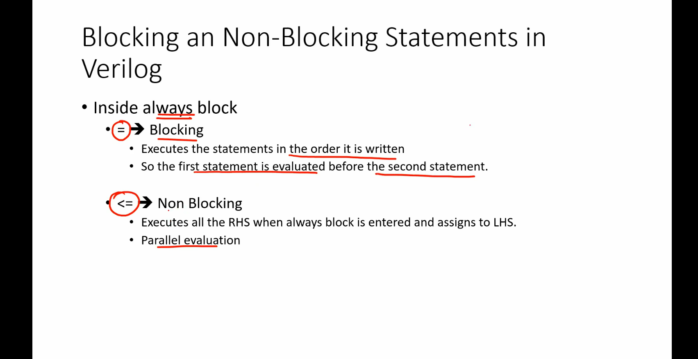
</div>


### 3.3 Comparison Table  

| **Aspect**                     | **Blocking (`=`)**                  | **Non-Blocking (`<=`)**             |
|--------------------------------|--------------------------------------|-------------------------------------|
| Execution Style                | Immediate, sequential               | Concurrent, scheduled               |
| Suitable For                   | Combinational logic                 | Sequential logic                    |
| Update Behavior                | Updates instantly in code order      | Updates applied after the time step |
| Common Use Case                | Temporary variables, calculations   | Registers, pipelines, flip-flops    |

---

## 4. Labs

### Lab 1: Ternary Operator MUX

Verilog code for a simple 2:1 multiplexer using a ternary operator:

```verilog
module ternary_operator_mux (input i0, input i1, input sel, output y);
  assign y = sel ? i1 : i0;
endmodule
```
- **Function:** `y = i1` if `sel = 1`; else `y = i0`.

 <div align="center">
  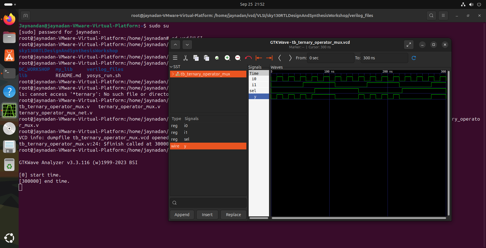
</div>

---

### Lab 2: Synthesis Using Yosys

Synthesize the above MUX using Yosys.  
_Follow the standard Yosys synthesis flow._

 <div align="center">
  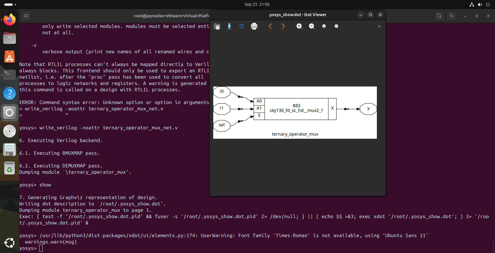
</div>

---

### Lab 3: Gate-Level Simulation (GLS) of MUX

Run GLS for the synthesized MUX.  
Use this command (adjust paths as needed):

```shell
iverilog /path/to/primitives.v /path/to/sky130_fd_sc_hd.v ternary_operator_mux.v testbench.v
```

 <div align="center">
  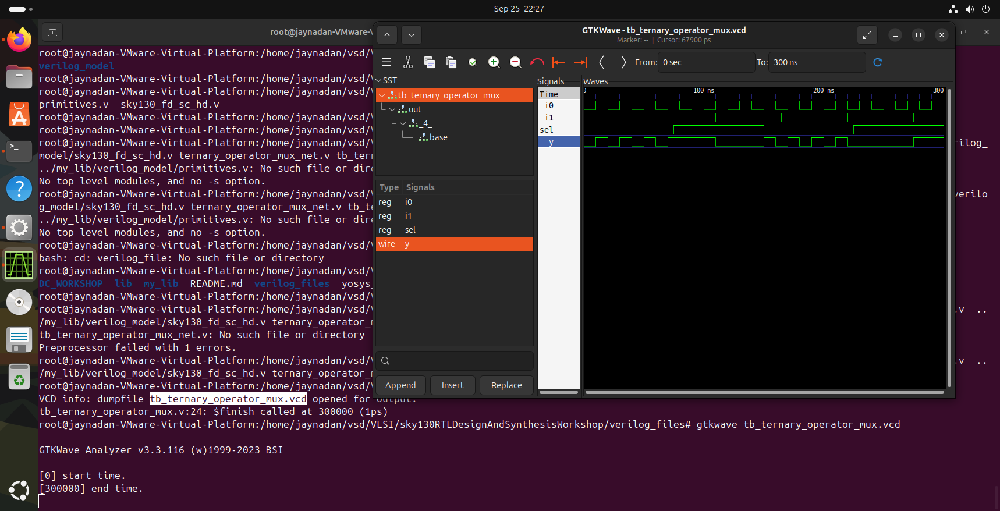
</div>
---

### Lab 4: Bad MUX Example 

Verilog code with intentional issues:

```verilog
module bad_mux (input i0, input i1, input sel, output reg y);
  always @ (sel) begin
    if (sel)
      y <= i1;
    else 
      y <= i0;
  end
endmodule
```

#### Issues:
- **Incomplete sensitivity list**: Should include `i0`, `i1`, and `sel`.
- **Non-blocking assignment in combinational logic**: Should use blocking assignments (`=`).

**Corrected version:**
```verilog
always @ (*) begin
  if (sel)
    y = i1;
  else
    y = i0;
end
```

 <div align="center">
  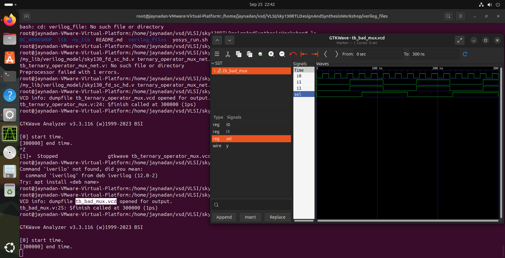
</div>

---
### Lab 5: Synthesis Using Yosys

Synthesize the above bad MUX using Yosys.  
_Follow the standard Yosys synthesis flow._

 <div align="center">
  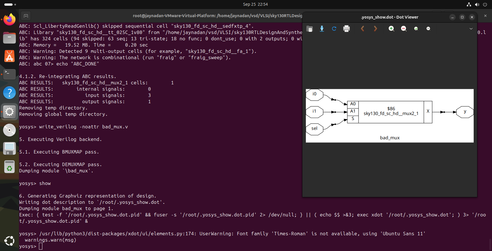
</div>

---

### Lab 6: GLS of Bad MUX

Perform GLS on the `bad_mux`.  
Expect simulation mismatches or warnings due to above issues.

 <div align="center">
  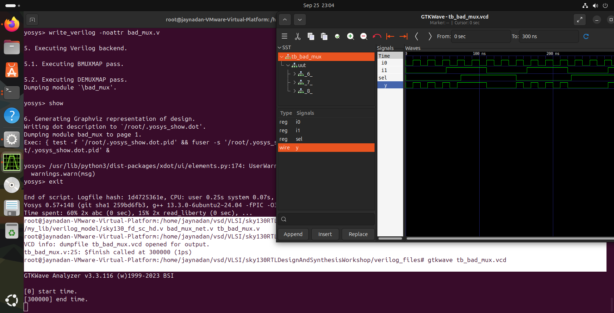
</div>

---

### Lab 7: Blocking Assignment Caveat

Verilog code:

```verilog
module blocking_caveat (input a, input b, input c, output reg d);
  reg x;
  always @ (*) begin
    d = x & c;
    x = a | b;
  end
endmodule
```

#### What’s wrong?
- The order of assignments causes `d` to use the old value of `x`—not the newly computed value.
- **Best Practice:** Assign intermediate variables before using them.

**Corrected order:**
```verilog
always @ (*) begin
  x = a | b;
  d = x & c;
end
```

 <div align="center">
  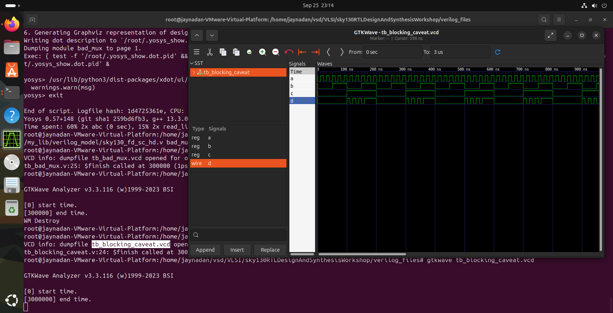
</div>

---

### Lab 8: Synthesis of the Blocking Caveat Module

Synthesize the corrected version of the module and observe the results.

 <div align="center">
  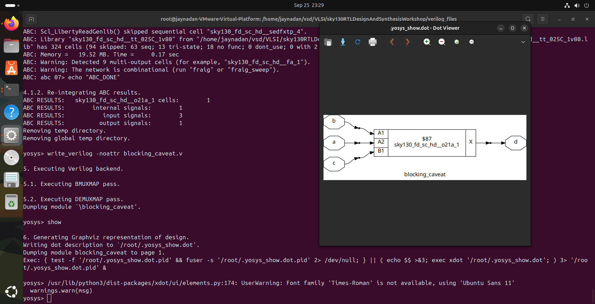
</div>

---
### Lab 9: GLS of bloaking-caveat

Perform GLS on the `bad_mux`.  
Expect simulation mismatches or warnings due to above issues.

 <div align="center">
  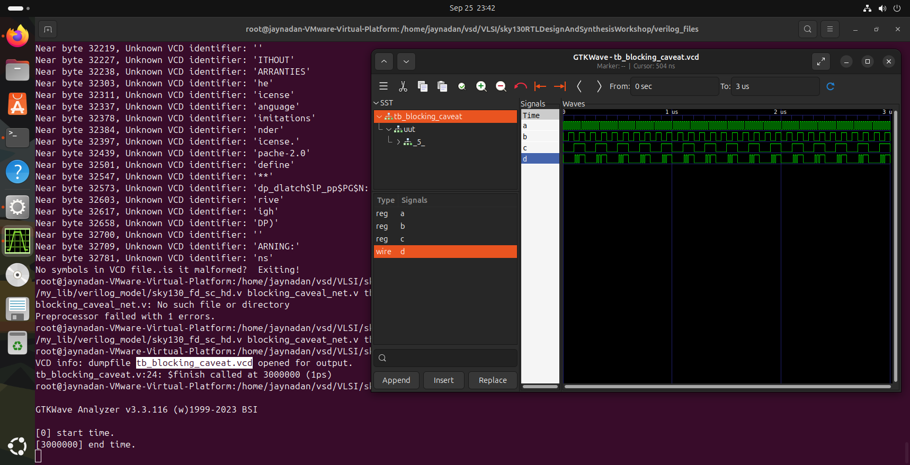
</div>

---

## ✨ Summary  

Day 4 was all about understanding how designs behave after synthesis and ensuring that what you simulate in RTL is the same as what ends up in hardware.  

- We began with **Gate-Level Simulation (GLS)**, a critical step that validates the gate-level netlist produced by synthesis. GLS not only checks functional correctness but also verifies timing (with real delays) and test structures like scan chains, ensuring the design is production-ready.  

- Next, we explored **synthesis-simulation mismatches**, which often arise from non-synthesizable constructs, ambiguous coding styles, or tool interpretation differences. The lesson here was clear: always use clean, synthesizable RTL and follow coding best practices to avoid surprises later in the flow.  

- Finally, we studied **blocking vs non-blocking assignments in Verilog**, two fundamental concepts that directly affect whether hardware is inferred as combinational or sequential. Correct usage of these assignments ensures predictable behavior, especially in clocked designs.  

**Overall takeaway:** Day 4 emphasized the importance of writing RTL that not only functions in simulation but also translates accurately into real hardware. By mastering GLS, avoiding mismatches, and using assignments correctly, you strengthen your ability to design circuits that are both reliable and synthesis-friendly.  
