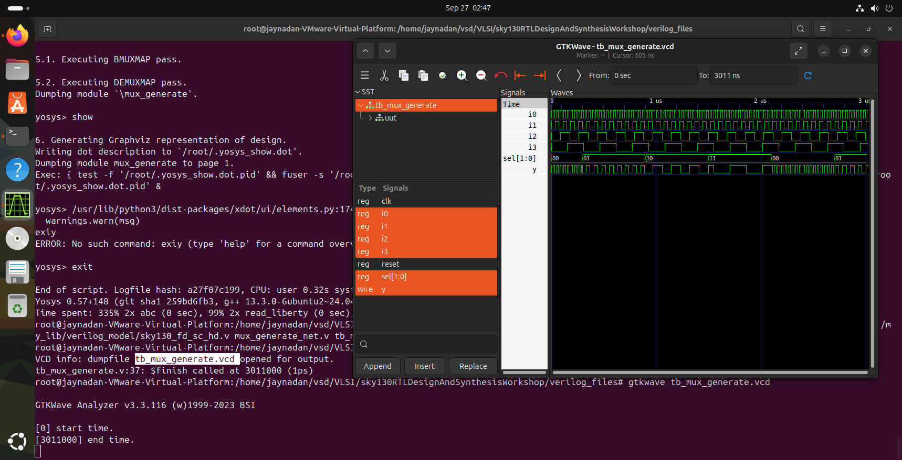

# Day 5 – Optimization in Synthesis

**Author:** Jaynandan Kushwaha

## 📌 Introduction

Day 5 focuses on the **optimization phase of synthesis**, where we refine coding techniques to achieve efficient hardware implementation. The day emphasizes how conditional constructs like **if** and **case** statements impact synthesized logic and how incomplete specifications can lead to unintended hardware such as latches.

We then move into the subtleties of **overlapping case constructs**, examining how synthesis tools interpret them and how to avoid mismatches between simulation and implementation. Finally, we explore the use of **for loops and generate statements**, powerful constructs that enhance code reusability and scalability, while also observing how synthesis tools optimize them.

This day is all about writing RTL that is not only functionally correct but also **optimized for synthesis, area, timing, and power**.

---

## 📚 Contents

### 🔹 1. If Case Constructs

* 📖 **Lecture 1:** IF Case Constructs – Part 1
* 📖 **Lecture 2:** IF Case Constructs – Part 2
* 📖 **Lecture 3:** IF Case Constructs – Part 3

### 🔹 2. Incomplete IF Case

* 🧩 **Lab 1:** Incomplete IF – Part 1
* 🧩 **Lab 2:** Incomplete IF – Part 2

### 🔹 3. Incomplete Overlapping Case

* 🧩 **Lab 1:** Incomplete Overlapping Case – Part 1
* 🧩 **Lab 2:** Incomplete Overlapping Case – Part 2
* 🧩 **Lab 3:** Incomplete Overlapping Case – Part 3
* 🧩 **Lab 4:** Incomplete Overlapping Case – Part 4

### 🔹 4. For Loop and For Generate

* 📖 **Lecture 1:** For Loop and For Generate – Part 1
* 📖 **Lecture 2:** For Loop and For Generate – Part 2
* 📖 **Lecture 3:** For Loop and For Generate – Part 3

### 🔹 5. Labs on For Loop and For Generate

* 🧩 **Lab 1:** For Loop and For Generate – Part 1
* 🧩 **Lab 2:** For Loop and For Generate – Part 2
* 🧩 **Lab 3:** For Loop and For Generate – Part 3

---

## ✨ Key Takeaways

* Correct usage of **if** and **case** constructs prevents unintended latch inference.
* Understanding incomplete and overlapping conditions is essential for **simulation-synthesis consistency**.
* **For loops** and **generate statements** improve modularity and reusability, while being efficiently optimized by synthesis tools.
* Optimization is not just about functionality—it’s about writing RTL that is **clean, efficient, and scalable**.

## Labs

### 1 Incomplete_if 

```verilog
module incomp_if (input i0 , input i1 , input i2 , output reg y);
always @ (*)
begin
	if(i0)
		y <= i1;
end
endmodule
```
#### .Gtkwave Output

<div align="center">
  
</div>

#### .Synthesis Output 

<div align="center">
  
</div>

###  2 Incomplete_if2
```verilog
module incomp_if2 (input i0 , input i1 , input i2 , input i3, output reg y);
always @ (*)
begin
	if(i0)
		y <= i1;
	else if (i2)
		y <= i3;

end
endmodule
```
#### .Gtkwave Output

<div align="center">
  
</div>

#### .Synthesis Output 

<div align="center">
  
</div>

### 3 Incomp-Case
```verilog
module incomp_case (input i0 , input i1 , input i2 , input [1:0] sel, output reg y);
always @ (*)
begin
	case(sel)
		2'b00 : y = i0;
		2'b01 : y = i1;
	endcase
end
endmodule
```
#### .Gtkwave Output

<div align="center">
  
</div>

#### .Synthesis Output 

<div align="center">
  
</div>

### 4 Complete_Caase
```verilog
module comp_case (input i0 , input i1 , input i2 , input [1:0] sel, output reg y);
always @ (*)
begin
	case(sel)
		2'b00 : y = i0;
		2'b01 : y = i1;
		default : y = i2;
	endcase
end
endmodule
```
#### .Gtkwave Output

<div align="center">
  
</div>

#### .Synthesis Output 

<div align="center">
  
</div>

### 5 Partial Case Assign
```verilog
module partial_case_assign (input i0 , input i1 , input i2 , input [1:0] sel, output reg y , output reg x);
always @ (*)
begin
	case(sel)
		2'b00 : begin
			y = i0;
			x = i2;
			end
		2'b01 : y = i1;
		default : begin
		           x = i1;
			   y = i2;
			  end
	endcase
end
endmodule
```
#### .Gtkwave Output

<div align="center">
  
</div>

#### .Synthesis Output 

<div align="center">
  
</div>

### 6 Bad Case

```verilog
module bad_case (input i0 , input i1, input i2, input i3 , input [1:0] sel, output reg y);
always @(*)
begin
	case(sel)
		2'b00: y = i0;
		2'b01: y = i1;
		2'b10: y = i2;
		2'b1?: y = i3;
		//2'b11: y = i3;
	endcase
end

endmodule
```
#### .Gtkwave Output

<div align="center">
  
</div>

#### .Synthesis Output 

<div align="center">
  
</div>

#### .GLS Output 
<div align="center">
  
</div>

### 7 mux_ Genrated 

```verilog
module mux_generate (input i0 , input i1, input i2 , input i3 , input [1:0] sel  , output reg y);
wire [3:0] i_int;
assign i_int = {i3,i2,i1,i0};
integer k;
always @ (*)
begin
for(k = 0; k < 4; k=k+1) begin
	if(k == sel)
		y = i_int[k];
end
end
endmodule


```
#### .Gtkwave Output

<div align="center">
  
</div>

#### .Synthesis Output 

<div align="center">
  
</div>

#### .GLS Output 
<div align="center">
  
</div>

### 8 demux case

```verilog
module demux_case (output o0 , output o1, output o2 , output o3, output o4, output o5, output o6 , output o7 , input [2:0] sel  , input i);
reg [7:0]y_int;
assign {o7,o6,o5,o4,o3,o2,o1,o0} = y_int;
integer k;
always @ (*)
begin
y_int = 8'b0;
	case(sel)
		3'b000 : y_int[0] = i;
		3'b001 : y_int[1] = i;
		3'b010 : y_int[2] = i;
		3'b011 : y_int[3] = i;
		3'b100 : y_int[4] = i;
		3'b101 : y_int[5] = i;
		3'b110 : y_int[6] = i;
		3'b111 : y_int[7] = i;
	endcase

end
endmodule

```
#### .Gtkwave Output

<div align="center">
  
</div>

#### .Synthesis Output 

<div align="center">
  
</div>

#### .GLS Output 
<div align="center">
  
</div>

### 9 demux generated

```verilog
module demux_generate (output o0 , output o1, output o2 , output o3, output o4, output o5, output o6 , output o7 , input [2:0] sel  , input i);
reg [7:0]y_int;
assign {o7,o6,o5,o4,o3,o2,o1,o0} = y_int;
integer k;
always @ (*)
begin
y_int = 8'b0;
for(k = 0; k < 8; k++) begin
	if(k == sel)
		y_int[k] = i;
end
end
endmodule

```
#### .Gtkwave Output

<div align="center">
  
</div>

#### .Synthesis Output 

<div align="center">
  
</div>

#### .GLS Output 
<div align="center">
  
</div>

### RCA 

```verilog
FA.v
module fa (input a , input b , input c, output co , output sum);
	assign {co,sum}  = a + b + c ;
endmodule
 RCA.v
module rca (input [7:0] num1 , input [7:0] num2 , output [8:0] sum);
wire [7:0] int_sum;
wire [7:0]int_co;

genvar i;
generate
	for (i = 1 ; i < 8; i=i+1) begin
		fa u_fa_1 (.a(num1[i]),.b(num2[i]),.c(int_co[i-1]),.co(int_co[i]),.sum(int_sum[i]));
	end

endgenerate
fa u_fa_0 (.a(num1[0]),.b(num2[0]),.c(1'b0),.co(int_co[0]),.sum(int_sum[0]));


assign sum[7:0] = int_sum;
assign sum[8] = int_co[7];
endmodule
```
#### .Gtkwave Output

<div align="center">
  
</div>

### Note:- All generating steps are in lab1 for how to run yosys iverilog tool i just use them to complete these lab 
for generating gls output we use iverilog tool with special library 
for example generating gls gtkwave for bad_mux :
```command

iverilog ../my_lib/verilog_model/primitive.v ../my_lib/verilog_model/sky130_fd_sc_hd.v bad_mux_net.v tb_bad_mux.v
```
and for writing .net file
when we synthesise before show in yosys we will use command this to generate netlist:
``` command
write_verilog  bad_mux_net.v

```
and it will write netlist and use this netlist file in iverilog for generating gls 
